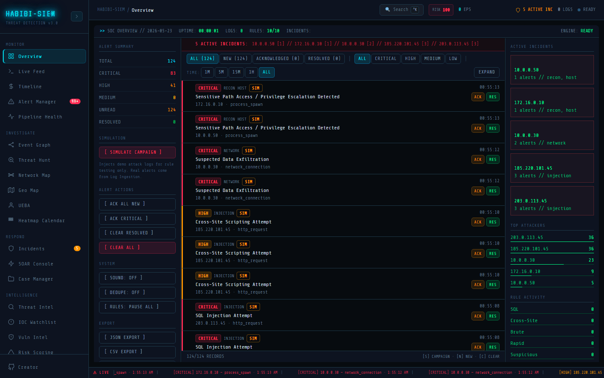
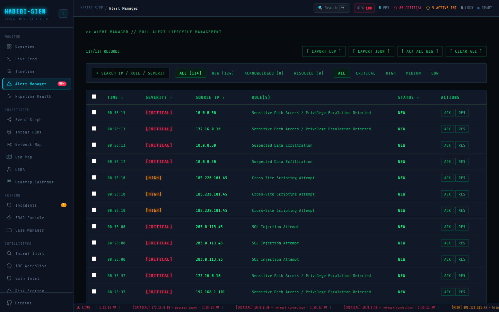
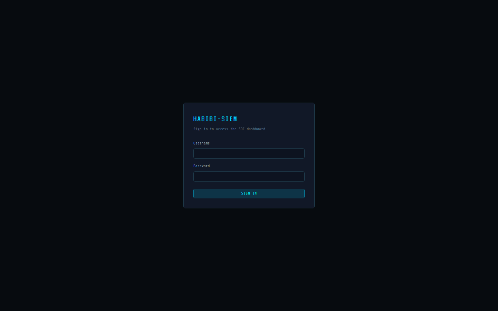
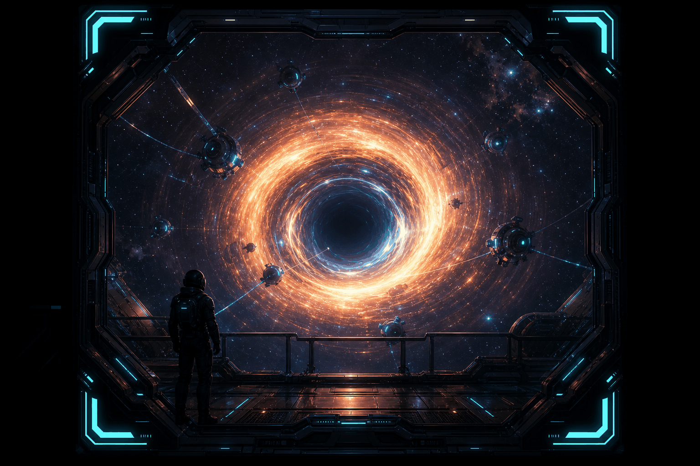

<div align="center">

# HABIBI-SIEM — Documentation Site

**The fastest way to make a non-technical stakeholder understand threat detection is to let them play the breach.**

</div>

<div align="center">

<a href="https://number-1-python-glazer.github.io/SIEM-Dashboard-Documentation/?v=12.2.0-orbit">

</a>

<br /><br />

[](https://number-1-python-glazer.github.io/SIEM-Dashboard-Documentation/?v=15.2.0)
[](https://number-1-python-glazer.github.io/SIEM-Dashboard-Documentation/brain/?v=15.2.0)

<br />

[](https://number-1-python-glazer.github.io/SIEM-Dashboard-Documentation/)
[](docs/)
[](guides/)
[](pentests/)

</div>

---

## The Problem With Security Documentation

A CISO reads a runbook. A CTO skims an architecture diagram. An investor closes the PDF. A junior analyst reads the guide but doesn't retain it until they've seen an alert fire.

None of them understand what the system actually does.

This site is the alternative — 17 hand-crafted interactive experiences that communicate SIEM concepts through doing instead of reading. Play the stealth game and you understand why detection rules exist. Build a rule in The Forge and you understand threshold tuning. Watch The Simulation and you understand a kill chain faster than any slide deck. Land on the Observation Deck and every component of the architecture is immediately spatial and memorable.

Technical depth for engineers. Intuitive experience for everyone else. This is what normalising complex security infrastructure to stakeholders looks like in practice — not a presentation, not a whitepaper, an environment they can explore.

---

## The 17 Experiences

| Experience | What it teaches |
|:-----------|:----------------|
| **Meridian-7** — Landing | The scale and ambition of the system before you've seen a single line of code |
| **Observation Deck** | Full architecture as a living cosmos — every module, every connection, every dependency |
| **The War Room** | Real-time attack simulation across a tactical grid |
| **The Signal Room** | Six signal modes showing how the detection engine processes noise into intelligence |
| **The Terminal** | Full interactive shell — `ssh`, `grep`, `tail -f`, `nmap`, `sudo` — the system from the inside |
| **The Breach** | Playable SOC incident response — triage alerts, isolate nodes, contain threats in real time |
| **The Ghost Network** | Infinite procedural network with live threat propagation and packet capture |
| **The Cipher** | Detection docs unlocked through six cryptography puzzles |
| **The Simulation** | Cinematic MITRE ATT&CK kill chain reconstructions with SIEM interception |
| **The Interrogation Room** | Intercepted attacker-C2 communications annotated with detection rules |
| **The Forge** | Visual drag-and-drop detection rule builder with live testing |
| **The Deep Archive** | 3D library — navigate filing cabinets to read technical documentation |
| **The Heist** | Stealth game — breach the system from the attacker's perspective |
| **The Cartography** | WebGL globe with live attack arc visualizations by threat actor and tactic |
| **The Lab** | Payload injection sandbox — fire real attack patterns, watch the SIEM catch them |
| **The Memorial** | Six famous breaches reconstructed as scroll narratives with SIEM interception mapping |
| **The Resonance** | SIEM detection rules as a playable synthesizer — six rules, six instruments |

---

## Stack

No framework. No build step. Ships as static HTML.

```
Three.js · Globe.gl · D3.js · Tone.js · Kaboom.js · xterm.js
GSAP · CodeMirror · interact.js · Lenis · Howler.js · Chart.js
```

---

## Console

<table>
<tr>
<td align="center" width="50%">
<a href="https://number-1-python-glazer.github.io/SIEM-Dashboard-Documentation/brain/?v=7.0.0-wormhole">

</a>
<br /><strong>SOC Overview</strong><br />
<sub><a href="guides/monitor/overview/01-how-to-use.md">Guide →</a></sub>
</td>
<td align="center" width="50%">
<a href="https://number-1-python-glazer.github.io/SIEM-Dashboard-Documentation/">

</a>
<br /><strong>Alert Manager</strong><br />
<sub><a href="guides/monitor/alert-manager/01-how-to-use.md">Guide →</a></sub>
</td>
</tr>
<tr>
<td align="center">

<br /><strong>Login</strong>
</td>
<td align="center">
<a href="https://number-1-python-glazer.github.io/SIEM-Dashboard-Documentation/brain/?v=7.0.0-wormhole">

</a>
<br /><strong>Architecture map</strong> · live interactive scene
</td>
</tr>
</table>

---

## Navigation

| Control | Action |
|:--------|:-------|
| **◎ / Home** | Recenter wormhole |
| **Double-click center** | Zoom into map focus |
| **Search** | Filter modules · alert mode on critical rules |
| **Click node** | Open that module's documentation panel |
| **◀ ▶ chevrons** | Move between experiences |
| **Ctrl+K** | Global command palette |

---

## Documentation

<table>
<tr>
<td align="center" width="25%">

**Guides**
27 module walkthroughs

[Open →](guides/README.md)

</td>
<td align="center" width="25%">

**Docs**
10 technical volumes

[Browse →](docs/02-architecture/00-system-overview.md)

</td>
<td align="center" width="25%">

**Pentests**
3 security reports

[Read →](pentests/pentest-01-broken-access-control.md)

</td>
<td align="center" width="25%">

**SIEM Repo**
The dashboard itself

[View →](https://github.com/Number-1-Python-Glazer)

</td>
</tr>
</table>

---

<details>
<summary><strong>Repository layout</strong></summary>

| Path | Contents |
|:-----|:---------|
| [`index.html`](index.html) | Landing — Meridian-7 |
| [`brain/`](brain/) | Observation Deck |
| [`left.html`](left.html) | The War Room |
| [`right.html`](right.html) | The Signal Room |
| [`terminal.html`](terminal.html) | The Terminal |
| [`breach.html`](breach.html) | The Breach |
| [`network.html`](network.html) | The Ghost Network |
| [`cipher.html`](cipher.html) | The Cipher |
| [`sim.html`](sim.html) | The Simulation |
| [`intercept.html`](intercept.html) | The Interrogation Room |
| [`forge.html`](forge.html) | The Forge |
| [`archive.html`](archive.html) | The Deep Archive |
| [`heist.html`](heist.html) | The Heist |
| [`cartography.html`](cartography.html) | The Cartography |
| [`lab.html`](lab.html) | The Lab |
| [`memorial.html`](memorial.html) | The Memorial |
| [`resonance.html`](resonance.html) | The Resonance |
| [`docs/`](docs/) | 10 technical volumes |
| [`guides/`](guides/) | 27 module walkthroughs |
| [`pentests/`](pentests/) | 3 assessment write-ups |
| [`assets/`](assets/) | Shared JS, CSS, visuals |

</details>

---

> *Built with obsession.*
