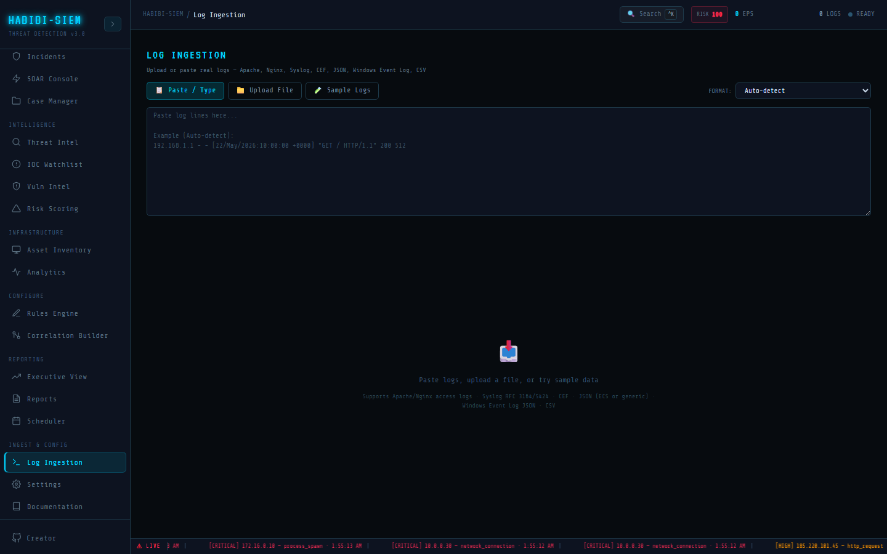

# The ingestion pipeline end to end

**Part of:** Ingest & Config → Log Ingestion
**One-sentence focus:** The five-stage path from client-side parse preview through validation, enrichment, detection, and alerts.

### What you are looking at

Ingest & Config → Log Ingestion offers three input modes via tabs: Paste / Type, Upload File, and Sample Logs. A **FORMAT** dropdown sits top-right, defaulting to Auto-detect and listing every parser the dashboard understands. Below the input area, a preview panel appears as soon as you paste or upload non-empty text. That panel shows a stats strip. **EVENTS PARSED**, **DETECTED FORMAT**, severity tiles (**CRITICAL**, **HIGH**, **MEDIUM**, **LOW**), and optionally **PARSE ERRORS** in orange, followed by a scrollable table with columns **TIME**, **SOURCE IP**, **USER**, **ACTION / EVENT**, **STATUS**, and **SEVERITY**. A prominent **INGEST N EVENTS INTO SIEM** button sits beneath the table. After a successful ingest, the header displays a green badge reading **EVENTS INGESTED** with the count, and the textarea clears. Think of this screen as the loading dock of the SIEM. Raw log lines arrive on trucks (paste, file upload, or sample); the preview station unpacks and labels each box; the ingest button sends approved cargo into the warehouse (`the SIEM context pipeline`); the detection engine's conveyor belt (`detection engine.processLogs`) scans each item against active rules, and anything suspicious falls into the alerts bin visible in Monitor → Alert Manager.

### What is happening underneath

The pipeline has five distinct stages, each implemented in a specific module. Stage 1, Client-side parse preview. Log Ingestion screen calls `parseLogText(rawText, format)` from log parsing layer on every text change, format change, file load, or sample click. The function returns `{ events, format, errors }`. Events are ECS-shaped objects with fields like `@timestamp`, `sourceIp`, `event.action`, `severity`, and `_raw` (the original line preserved). Preview is entirely local; nothing hits the server until you click ingest. Stage 2. Ingest trigger. The `ingest()` handler in Log Ingestion screen calls `processLogs(preview.events)` from the SIEM context pipeline. It passes only successfully parsed events; parse warnings do not block ingest unless zero events were produced. Stage 3. Server validation. Inside log processing, if the signed-in user has write permission (`canWrite`), the context POSTs the event batch to `api.validateLogs(logs)`, which maps to `POST /api/ingest/validate`. The server runs `sanitizeLogBatch()` from validation middleware, strips untrusted fields (especially `severity` and `simulated`), validates IPv4 addresses, caps `_raw` string length, and returns `{ events: sanitized, rejected, maxEvents: 5000 }`. If validation throws or the network fails, log processing logs the error and **returns `[]`**, no events enter the pipeline. Stage 4; Enrichment and storage. Surviving events get geo-enriched via `lookupGeoIpBatch()`, appended to `rawLogs` (capped at `MAX_RAW_LOGS = 500`), and counted in `logsProcessed`. EPS (events per second) metrics update from a rolling 60-second window. Stage 5. Detection and alert emission. `engineRef.current.processLogs(geoEnrichedLogs)` iterates each event against every enabled rule in `detectionRules`. Matching rules produce alert objects with `matchedRules[]`, inherited `severity`, and a reference to the source log. Alerts are deduplicated (optional), critical ones trigger audio beeps and SOAR IP lookups for external addresses, persisted via `api.saveAlerts()`, and merged into dashboard state. The ingest handler displays `{ count, alerts }` where `alerts` is the number of new alerts fired.

### Why this matters

Without a parse-preview-then-commit workflow, analysts would blindly flood the detection engine with malformed data, producing false negatives (unparsed lines silently dropped) or false positives (mis-mapped fields triggering wrong rules). The two-phase design. Local preview, server validation, then detection, mirrors production SIEM architectures where a collector normalizes events, an indexer validates schema, and a correlation engine evaluates rules. Understanding where each stage lives helps you debug "I ingested logs but see no alerts" (check preview severity, rule enablement, validation failure) versus "I see alerts but wrong IP" (check parser field mapping).

### Step-by-step walkthrough

1. Sign in with an analyst-or-above role that has write permission.
2. Open Ingest & Config → Log Ingestion.
3. Click Sample Logs and select Apache / Nginx access log to load realistic brute-force lines.
4. Observe the preview panel: note **EVENTS PARSED** count, **DETECTED FORMAT**, and severity breakdown.
5. Scroll the preview table; confirm **SOURCE IP**, **USER**, and **ACTION / EVENT** columns look correct.
6. Click **INGEST N EVENTS INTO SIEM**.
7. Watch the green **EVENTS INGESTED** badge appear in the header.
8. Navigate to Monitor → Live Feed to confirm events appear in `rawLogs`.
9. Open Monitor → Alert Manager to see whether rules (e.g. brute-force, suspicious user-agent) fired alerts.
10. Optionally open Respond → Incidents if correlated alerts grouped into an incident.

### Common questions

#### Why does preview happen before ingest instead of sending raw text to the server?

Parsing is CPU-cheap and instant in the browser, giving immediate feedback without rate-limit consumption. Server validation focuses on security sanitization, not format detection. This split keeps the validate endpoint fast and protects against malicious payloads while letting analysts iterate on format selection locally.

#### Does clicking ingest send the original raw text or parsed events?

Parsed events. The server receives a JSON array of normalized objects, not the original multiline string. Each event carries `_raw` preserving the source line for forensic reference.

#### What happens to alerts if I ingest the same sample twice?

Rules evaluate each batch independently. Dedupe logic in the SIEM context pipeline suppresses alerts matching the same `sourceIp`, primary `ruleId`, and timestamp within 30 seconds: if dedupe is enabled in Settings. Otherwise you may see duplicate alerts.

#### Can read-only users preview logs?

Yes. Preview uses client-side parsing only. Ingest calls log processing, which skips server validation when `canWrite` is false and still runs local detection. But persistence and SOAR side effects are gated behind write permission.

### Operational use during containment

During a suspected breach, an analyst exports web server or auth logs from the affected host, uploads the `.log` file via drag-and-drop, and selects the correct **FORMAT** if auto-detect misidentifies the source. They scan the preview table for attacker IPs, failed login patterns, and critical-severity rows before committing. After ingest, they pivot to Live Feed filtered on the suspect IP, then Alert Manager for rule hits. If the preview shows parse errors on key lines, they adjust format or manually fix lines before re-ingesting, avoiding a false "clean bill of health" from partial parsing.

### Edge cases and gotchas

Preview severity is inferred client-side by `inferSeverity()` and may differ after server sanitization strips the `severity` field; rules re-evaluate on their own criteria. Ingest clears the textarea and preview; there is no undo. Simulated campaign logs (`_simulated: true`) follow a separate path via Simulate Campaign on Overview. The detection engine accumulates `processedLogs` across ingests within a session: threshold rules counting events over time include prior batches. Internal IPs (`10.*`, `192.168.*`, `172.16.*`) ingest normally but skip external SOAR threat-intel lookup.

> **Technical note:** log processing in the SIEM context pipeline is async; Log Ingestion screen awaits it and reads the returned alert array length for the success badge. The detection engine reference (`engineRef`) persists across renders so rule hit counts accumulate session-wide.
