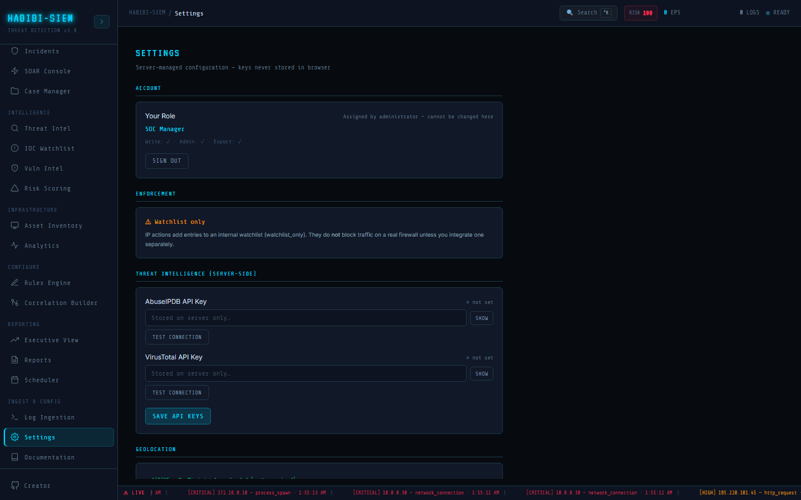

# Settings architecture

**Part of:** Ingest & Config → Settings
**One-sentence focus:** Server-global, RBAC-gated, and ephemeral client configuration tiers in Settings screen.

### What you are looking at

Ingest & Config → Settings shows a single scrollable column capped at roughly 700 pixels wide. The header reads **SETTINGS** in display font with a cyan accent, followed by a monospace subtitle: Server-managed configuration, keys never stored in browser. Below that, the screen is organised into labelled sections separated by thin cyan divider lines: **ACCOUNT**, **ENFORCEMENT**, optionally THREAT INTELLIGENCE (SERVER-SIDE) and **DATA MANAGEMENT** (visible only to admin-capable roles), then **GEOLOCATION**, **DETECTION PREFERENCES**, and **ABOUT**. Each block sits inside a card with padding. The ACCOUNT card shows your role label, a permission matrix line (Write, Admin, Export with checkmarks or crosses), and a **SIGN OUT** button. Admin users see masked password fields for AbuseIPDB and VirusTotal keys with **SHOW** / **HIDE** toggles, **TEST CONNECTION** buttons, and a primary **SAVE API KEYS** button. Non-admin users still see geolocation status, deduplication and sound toggles, and the ABOUT panel, but the threat-key and data-management cards are absent entirely, not greyed out. Think of Settings as the SOC's control panel for things that affect the whole platform (API keys, clearing alerts) versus things that affect only your browser session (sound, dedupe checkboxes). The layout deliberately avoids tabs or nested routes; everything is one vertical document so auditors can scroll once and see the full policy surface.

### What is happening underneath

The Settings screen and reads state from two React contexts. the SIEM context pipeline supplies `currentRole`, the `ROLES` map, `soundEnabled` / `setSoundEnabled`, `dedupeEnabled` / `setDedupeEnabled`, `clearAlerts`, `blockedIps`, `canAdmin`, and `enforcement`. `useAuth()` supplies `logout`. On mount, a `useEffect` calls `getGeoBackendStatus()` from the geo data module and, only when `canAdmin` is true, `api.getThreatSettings()` to populate masked key placeholders and `threatConfigured` flags. Configuration falls into three architectural tiers. Global server settings live in SQLite table `settings` (keys like `abuseipdb_key`, `virustotal_key`), encrypted at rest via `encryptSecret()` in the database layer using `SESSION_SECRET`. Keys can also be injected through environment variables (`ABUSEIPDB_API_KEY`, `VIRUSTOTAL_API_KEY`) which take precedence when set. Session-scoped RBAC is enforced on every mutating API call through `requirePermission('write' | 'admin' | 'export')` in server-side role permissions; the UI mirrors this with `{canAdmin && (...)}` conditional rendering rather than disabled placeholders, admin sections simply do not mount for tier1/tier2/auditor roles. Per-user / per-session client preferences (`soundEnabled`, `dedupeEnabled`) are React local screen state hooks in the SIEM context pipeline with no persistence to `user_prefs` table today; they reset on full page reload. Persistent operational data; alerts, watchlist, cases, SOAR log, audit entries: resides in `data/siem.db` (configurable via `SIEM_DB_PATH`). The `MaskedInput` sub-component keeps API key values as password fields by default. When the server returns a masked value like `••••••••abcd`, the save handler sends `undefined` for that field so unchanged keys are not overwritten. Only freshly typed plaintext is PUT to `/api/admin/settings/threat`.

### Why this matters

Splitting configuration into server-global, RBAC-gated, and ephemeral client layers is how a secured SIEM avoids the classic anti-pattern of storing vendor API keys in `localStorage` where any XSS payload can exfiltrate them. Operators need to know which knobs require a manager login versus which any analyst can flip during a night shift. Compliance reviewers ask whether "settings changes" are auditable: server-side key updates and alert clears are; checkbox preferences currently are not, documenting that gap prevents false assurance during SOC 2 interviews. The subtitle keys never stored in browser is a deployment promise: threat intel calls always proxy through `/api/threat/*` on the Express server, never directly from the React bundle.

### Step-by-step walkthrough

1. Sign in and open Ingest & Config → Settings from the sidebar.
2. Read the subtitle and confirm you understand server-managed keys versus local toggles.
3. In **ACCOUNT**, note your role label and the Write / Admin / Export matrix; this predicts which sections appear below.
4. Read **ENFORCEMENT** and internalise that watchlist actions do not block real firewall traffic.
5. If you are tier3 or manager, scroll to **THREAT INTELLIGENCE**; otherwise skip: those cards are not rendered for you.
6. Check **GEOLOCATION** status before relying on map modules elsewhere in the dashboard.
7. Adjust **DETECTION PREFERENCES** (dedupe, sound) to taste; these apply immediately in your session.
8. Admin users: review **DATA MANAGEMENT** watchlist count before any destructive **CLEAR ALL ALERTS** action.
9. Read **ABOUT** for version string and pointer to `SECURITY.md` hardening notes.

### Common questions

#### Why do some sections disappear when I log in as analyst1 versus manager?

The UI gates admin-only blocks with `canAdmin` from the authentication layer, which derives from the user's role in the database session. Tier 1 and Tier 2 analysts, plus Compliance Auditors, never receive `canAdmin: true`, so threat-key management and **CLEAR ALL ALERTS** are not mounted in the DOM.This is stronger than showing disabled controls that leak feature existence.

#### Are my sound and dedupe preferences saved for next login?

Not in the current build. They live in the SIEM context pipeline dashboard state only. Reloading the page resets both checkboxes to their default (`false`). The `user_prefs` table exists in the database layer schema but is not wired to Settings yet.

#### Where do API keys actually live after I click SAVE API KEYS?

They are written to the `settings` table in `data/siem.db`, encrypted when the key name ends with `_key`. The browser never retains plaintext after navigation; only masked suffixes return on GET.

#### Can I change my own role on this screen?

No. The hint under Your Role states Assigned by administrator, cannot be changed here. Role changes require direct database or future user-admin API work.

#### What is the difference between settings and environment variables?

Environment variables (`ABUSEIPDB_API_KEY`, `VIRUSTOTAL_API_KEY`, `SESSION_SECRET`, `SIEM_DB_PATH`) are read at server startup or on each `getThreatKeys()` call. UI-saved keys go to SQLite. Env vars win when both are set; useful for container deployments where UI key entry is disabled.

### What analysts do when the pager fires

During a noisy campaign, a Tier 2 analyst opens Settings not for keys but for Alert Deduplication: checking the box suppresses repeat critical beeps from the same IP and rule within the dedupe window (see dedicated section for the 60s label versus 30s code nuance). They enable Sound Alerts if the SOC floor is quiet and audible paging is acceptable. They cannot clear the alert database. That requires escalating to a Tier 3 or manager who confirms **CLEAR ALL ALERTS** in **DATA MANAGEMENT**. The analyst verifies **GEOLOCATION** shows **ACTIVE** before trusting geo-enriched incident maps. They note the **ENFORCEMENT** banner so leadership is not told "we blocked the attacker" when the platform only watchlisted the IP.

### Edge cases and gotchas

Settings max-width 700px means no responsive two-column layout, long API error messages wrap awkwardly beside **TEST CONNECTION**. If `canAdmin` flips mid-session (not supported live; would require re-login), the `useEffect` for threat settings would not re-fetch until remount. Geo status can read SERVER UP; database missing when Express runs but MaxMind files are absent: maps degrade silently elsewhere. The ABOUT card references HABIBI-SIEM v4.0 (Secured) which may drift from the application manifest version; treat it as marketing copy. Keyboard shortcut C for clear-all in Overview dashboard also requires admin via `clearAlerts` guard. Settings is not the only destructive entry point.

> **Technical note:** Settings screen imports `ROLES` directly from the SIEM context pipeline for display labels; server-side server-side role permissions maintains a parallel `ROLES` object, keep both in sync when adding roles.
