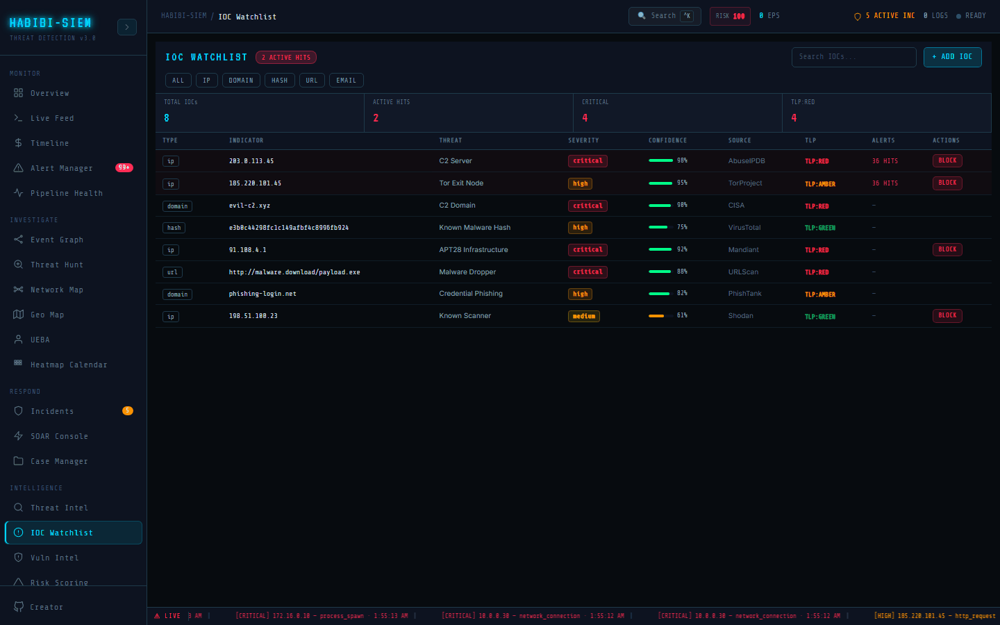

# What an indicator of compromise is

**Part of:** Intelligence → IOC Watchlist
**One-sentence focus:** Organisation-specific indicators matched against incoming alerts in real time.

### What you are looking at

Header **IOC WATCHLIST** with optional red badge **N ACTIVE HITS**, search box Search IOCs..., **+ ADD IOC** button, type filters (**ALL**, **IP**, **DOMAIN**, **HASH**, **URL**, **EMAIL**). Stats strip: TOTAL IOCs, **ACTIVE HITS**, **CRITICAL**, **TLP:RED**. Table columns **TYPE**, **INDICATOR**, **THREAT**, **SEVERITY**, **CONFIDENCE**, **SOURCE**, **TLP**, **ALERTS**, **ACTIONS**. Eight default IOCs ship baked in (C2 IPs, Tor exit, evil domain, malware hash, APT IP, malware URL, phishing domain, scanner IP). An IOC is a breadcrumb left by attackers, like a fingerprint at a crime scene, except the fingerprint might be an IP address or a file hash.

### What is happening underneath

`DEFAULT_IOCS` constant merged with user-added `iocWatchlist` from context: `{ id, type, value, threat, severity, source, tlp, confidence }`. Types enum `['ip','domain','hash','url','email']`. Matching in `iocMatches` memo scans all alerts per IOC: IP equality on `sourceIp`/`source.ip`; domain via `JSON.stringify(a).toLowerCase().includes(value)`; URL via `urlPath`/`url.path`; hash/email types display in the watchlist; extend `iocMatches` with hash and email comparison logic to activate hit detection for those types. Intelligence → IOC Watchlist (IOC Watchlist screen) merges immutable `DEFAULT_IOCS` with user `iocWatchlist` from context via `allIocs = [...DEFAULT_IOCS,...iocWatchlist]`. Supported types: ip, domain, hash, url, email, but matching logic in `iocMatches` fully implements IP (`sourceIp` / `source.ip`), domain (substring over `JSON.stringify(alert)`), and URL (`urlPath` / `url.path`); hash and email types display in the watchlist; extend `iocMatches` with hash and email comparison logic to activate hit detection for those types. Header badge **N ACTIVE HITS** counts IOCs with ≥1 match; matching rows gain pink background and blinking **N HITS** in **ALERTS** column.

`iocMatches` recomputes every render from the alerts array, latency equals React refresh, adequate for demo volumes but potentially costly if domain matching stringifies large alert JSON at enterprise EPS. Matches do not spawn new alert types; they overlay correlation on existing detections. False positives arise when domain substring appears innocuously inside unrelated alert fields; always manually validate a hit before executive briefing.

### Why this matters

Commercial feeds miss your organisation's context: partner breach IOCs, internal honeypot captures, industry ISAC shares. Local watchlist closes that gap.

### Step-by-step walkthrough

1. Open module after Simulate Campaign.
2. Scan **ACTIVE HITS** badge. Non-zero means immediate priority.
3. Sort visually by blinking **N HITS** in **ALERTS** column.
4. Read **THREAT** description and **TLP** colour.
5. For IP hits, consider **BLOCK** action.
6. Add organisation IOC via **+ ADD IOC** modal.

### Common questions

#### What's the difference between IOC and alert?

Alert is your system detecting suspicious behaviour; IOC is external knowledge that a specific indicator is known bad.

#### Example of hash IOC?

Default `e3b0c44298fc1c149afbf4c8996fb924` labelled malware hash; extend `iocMatches` with hash field comparison to enable active hit detection for hash-type IOCs.

#### User agent IOC?

Not a type in this UI; would need extension.

#### C2 server meaning?

Command-and-control server malware phones home to: IP 203.0.113.45 in demo.

### Using this view during live response

First action: check **ACTIVE HITS**. confirmed IOC match elevates certainty before detailed look. Add campaign-specific IOCs during active IR with appropriate TLP; remove user entries post-incident to prevent stale blocks; document adds in Case Manager until `addedAt` and author columns ship in UI. ISAC/STIX/TAXII import is manual today, treat modal **ADD IOC** as stand-in for feed ingestion automation. Pair watchlist hits with SOAR audit log entries when blocking to answer "why was this indicator actioned?"

Operationalise TLP labels in procedure documents because the UI only colour-codes them. Before clicking **BLOCK** on a blinking hit row, confirm the indicator is still valid; especially for domain matches that use broad JSON substring search. User-added IOCs should include campaign identifiers in Threat Description until audit columns expose `addedAt` and authenticated authors.

### Edge cases and gotchas

Hash/url/email types display but matching logic incomplete for hash/email. Domain match stringifies entire alert: noisy false positives possible. TLP colouring (**RED**, **AMBER**, **GREEN**, **WHITE**) communicates sharing constraints. Software does not enforce policy, humans do. **BLOCK** on IP rows calls `blockIp(ioc.value, \`IOC block: ${ioc.threat}\`)`, same watchlist mechanism as SOAR. Non-IP IOCs have no block button, domains require DNS/firewall action outside this UI. User-added IOCs get **Remove** via `removeIoc`; defaults cannot be deleted; plan production deployments that replace demo defaults with live feeds.
