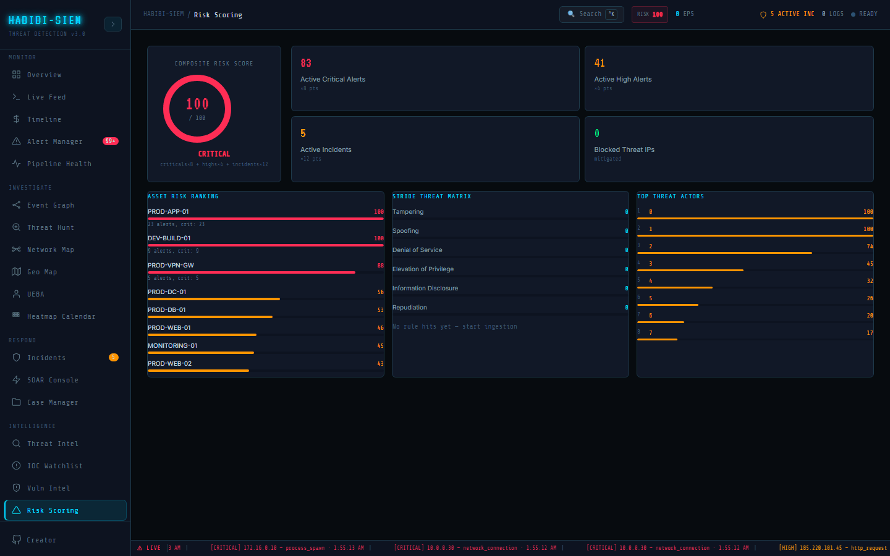

# Risk appetite and risk tolerance

**Part of:** Intelligence → Risk Scoring
**One-sentence focus:** Composite and per-asset risk numbers for posture reporting and triage.

### What you are looking at

Implicit bands on dial: **LOW RISK** <20 green, **GUARDED** 20–39 yellow, **ELEVATED** 40–69 orange, **CRITICAL** ≥70 red (`riskColor` function). Organisation defines appetite by choosing action thresholds matching these colours.

### What is happening underneath

No configurable tolerance UI; hardcoded breakpoints in component. Governance would map: e.g., appetite 40 means escalate at **ELEVATED**. Intelligence → Risk Scoring (Risk Scoring screen) presents a composite dial plus decomposition cards so executives see one number while practitioners see arithmetic. Global `riskScore` from the SIEM context pipeline: `min(100, critActive*8 + highActive*4 + activeIncidents*12)`; unresolved critical/high alerts and incidents with `status === 'active'` only; medium/low alerts and blocked IPs do not subtract from composite (blocked card is informational mitigated). Dial colours: green **LOW RISK** <20, yellow **GUARDED** 20–39, orange **ELEVATED** 40–69, red **CRITICAL** ≥70, hardcoded, not Settings-configurable. Asset ranking recomputes per asset: `min(100, criticality*5 + critAlerts*8 + highAlerts*4 + cves.length*3)`, listing top eight by score with optional subtext N alerts, crit: M. `getCriticalityLabel()` is imported but unused; criticality visible only indirectly. STRIDE matrix aggregates `detectionRules` `hits` by `stride` field with bar width `min(100, hits*20)%`; `critHits` computed but not displayed. Known implementation gaps: `strideRisks` useMemo uses empty deps `[]` so hits may stale until navigation remounts; `threatIpList` uses `Object.entries(threatScores)` while context supplies an array from `buildThreatScores`, potentially displaying index keys 0, 1 instead of IPs: verify in browser and prefer Threat Intel for accurate IP lists until fixed. When the composite dial reads **CRITICAL**, walk executives through the breakdown cards arithmetically before recommending spend. Remember blocked IPs appear as mitigated informationally but do not subtract from the formula today. If **TOP THREAT ACTORS** shows numeric indices instead of IPs, use Threat Intel external cards until the `Object.entries` data-shape issue is corrected in Risk Scoring screen.

### Why this matters

Without appetite, numbers lack decision trigger. "70" meaningless until board says "above 70 = mandatory war room."

### Step-by-step walkthrough

1. Document organisational appetite (example: tolerate ≤39 guarded).
2. During incident, compare live score to appetite.
3. Breach tolerance → invoke major incident process.
4. After recovery, demand remediation to return below appetite.

### Common questions

Not in Settings, configuration change required.

#### Risk appetite vs tolerance?

Appetite = willing baseline risk; tolerance = max acceptable deviation; both map to dial bands conceptually.

#### Accept risk formally?

#### Insurance cyber rider?

May reference composite metrics if documented methodology stable.

### How an analyst uses this during an active incident

States "score 78 exceeds our tolerance 70" to trigger executive call per runbook.

### Edge cases and gotchas

Single metric hides compensating controls: pair with qualitative narrative. Demo Simulate can spike score artificially. Label exercises. Composite score is activity-weighted, not breach probability. It can plummet when alerts resolve while root cause remains unpatched (Vuln Intel still shows high CVSS). Auto-incident contained after sixty seconds quiet reduces incident weight without human verification, pair dial readings with Threat Intel and open Case Manager counts during P1. Capture screenshots before/after containment for timeline evidence; no built-in history series exists though `epsHistory` elsewhere suggests a pattern for future `riskHistory`. Lead with dial label and number, cite top three **ASSET RISK RANKING** names in business terms, dominant STRIDE bar category, and count of Blocked Threat IPs as response evidence, not as score reduction. Explicitly state formula footnote (criticals×8 + highs×4 + incidents×12) so finance and audit can reproduce the metric. Label Simulate Campaign exercises in verbal briefings to avoid comparing lab spikes to production baselines.
