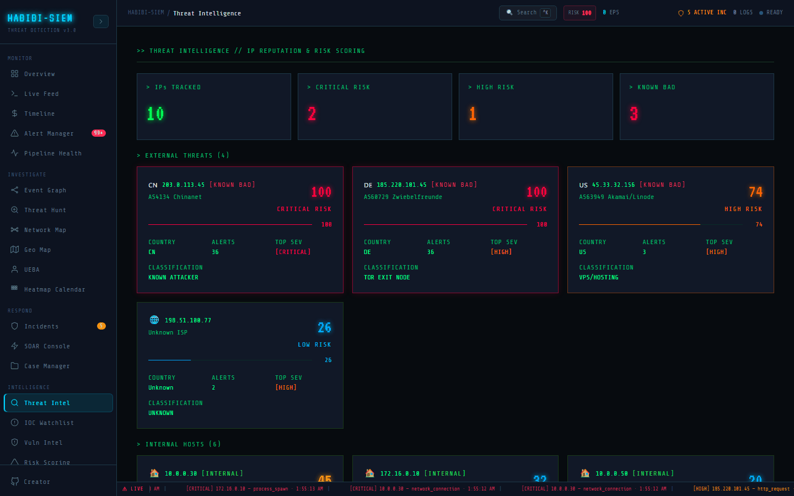

# How the dashboard queries feeds

**Part of:** Intelligence → Threat Intel
**One-sentence focus:** IP reputation and composite risk scores derived from alerts and static threat data.

### What you are looking at

Automatic: On ingest, high/critical external alerts trigger `soarCheckIp` (SOAR), not Threat Intel refresh (which is passive recompute). On-demand: Threat Intel updates when you navigate to it after new alerts; SOAR Manual Lookup for explicit queries.

### What is happening underneath

Threat Intel has no "Lookup" button; purely derived view. Enrichment at alert creation adds `geo` via MaxMind batch in log processing. Threat scores recompute from full alert set each render cycle. Intelligence → Threat Intel (Threat Intel screen) transforms raw alert IPs into prioritised ThreatCard rows using `buildThreatScores()` from threat intelligence module. The page is passive: no lookup button, no API calls to AbuseIPDB; those belong to SOAR Console → Manual Lookup. Cards split **EXTERNAL THREATS** vs **INTERNAL HOSTS** via `isInternal()` prefix checks (`192.168.`, `10.0.`, `172.16.`). Scores combine static `THREAT_DB` base values with dynamic alert weight `min(count*3, 40)`, capped at 100. Footer **SCORING METHODOLOGY** documents bands: 0–39 low, 40–59 medium, 60–79 high, 80–100 critical, note SOAR auto-block uses 75, not 80, a deliberate or accidental mismatch worth harmonising in runbooks.

### Why this matters

Analysts must know where to click for active vs passive intel; wrong module slows response.

### Step-by-step walkthrough

1. Ingest logs → alerts fire → SOAR auto lookup runs.
2. Open Threat Intel → scores include new dynamic weight.
3. For IP not yet alerted, SOAR Manual Lookup only path.
4. Compare timestamps: alert time vs lookup log time.

### Common questions

#### Does threat intel poll feeds continuously?

No: recalculates from alerts in memory.

#### When is geo added?

#### Can I force refresh?

Navigate away and back or trigger new alert. No refresh button.

#### Enrichment at alert creation vs case creation?

Alert ingest only in this app.

### Operational use during containment

Rely on auto SOAR for speed; open Threat Intel for situational ranking across all attackers.

### Edge cases and gotchas

IPs alerted once long ago keep elevated dynamic score until alerts cleared. No TTL decay in `buildThreatScores`. KPI tiles (IPs TRACKED, **CRITICAL RISK**, **HIGH RISK**, **KNOWN BAD**) give executives at-a-glance posture without reading every card. [KNOWN BAD] blink tags appear when IP exists in static DB; border glow activates at scores ≥80. **TOP SEV** surfaces highest alert severity per IP using bracketed labels like [CRITICAL]. Empty state **NO DATA // GENERATE ALERTS FIRST** triggers when `alerts.length === 0`, Threat Intel is downstream of detection, reinforcing that intelligence here is processed alert data plus curated DB entries, not a standalone feed download. Use Threat Intel to rank which IPs deserve expensive AbuseIPDB queries first during alert floods; use SOAR to execute lookups and watchlist adds; use IOC Watchlist for organisational indicators (domains, hashes, campaign-specific C2) that static DB will miss. VirusTotal is referenced in IOC defaults but not wired into Threat Intel scoring. CISA-known-bad client stub returns false in browser; server-side lookup paths may set flags during SOAR enrichment instead. Scores recompute from current alerts only: no historical IP memory after alerts clear. Dynamic portion lacks TTL decay; an IP quiet for weeks but still in alert store keeps elevated weight. Clearing all alerts empties Threat Intel entirely, which can surprise executives expecting a persistent bad-guy list. Weekly process: reconcile top cards with SOAR watchlist, remove stale blocks, refresh classifications via Manual Lookup before major incidents. Threat Intel ranks observed attacker IPs; it does not replace SOAR enrichment. When scores disagree with AbuseIPDB confidence in Manual Lookup, explain the difference: static `THREAT_DB` base plus capped dynamic alert weight versus crowd-sourced abuse reports. Harmonise executive thresholds with SOAR auto-block at 75 or document why critical cards start at 80 while automation fires earlier.
