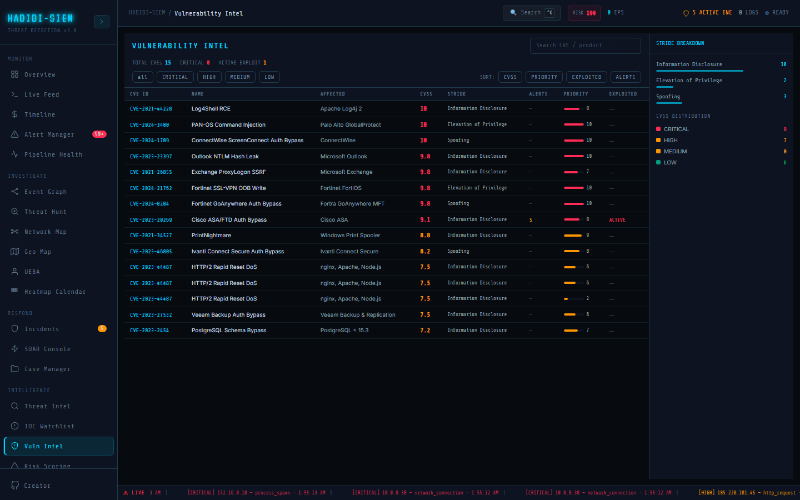

# Matching vulnerability data to asset inventory

**Part of:** Intelligence → Vuln Intel
**One-sentence focus:** CVE data mapped to asset inventory with prioritisation and exploitation heuristics.

### What you are looking at

**AFFECTED** column product name (Palo Alto GlobalProtect, Fortinet FortiOS). Detail sidebar Asset field shows `asset.name` or Multiple / Unknown for orphan CVE rows.

### What is happening underneath

Loop: `ASSETS.forEach` → each `asset.cves` → lookup metadata → attach `asset` object. Alerts filtered where `a.sourceIp === asset.ip || a.destIp === asset.ip`. Patch priority: `Math.round(cveInfo.cvss * asset.criticality / 10)`. Intelligence → Vuln Intel (Vulnerability Intel screen) joins three data sources: `ASSETS` from static asset registry (each with `cves[]`), merged CVE metadata from `CVE_DB` and `EXTENDED_CVE_DB`, and live alerts matching asset IPs on `sourceIp` or `destIp`. Exploitation flag `exploited: true` when asset-linked alerts include any critical or high severity; heuristic detection overlap, not malware sandbox confirmation. Header stats (TOTAL CVEs, **CRITICAL**, **ACTIVE EXPLOIT**) and filters/sorts (**CVSS**, **PRIORITY**, **EXPLOITED**, **ALERTS**) help patch teams queue work; sidebar toggles between aggregate **STRIDE BREAKDOWN** / **CVSS DISTRIBUTION** and per-row **CVE DETAIL**.

### Why this matters

CVE alone is academic; "CVSS 10" matters when on internet-facing VPN concentrator handling customer data.

### Step-by-step walkthrough

1. Open Infrastructure → Asset Inventory note IP and criticality of VPN node.
2. Return Vuln Intel; find CVE on same product.
3. Compare Asset name in detail pane.
4. Cross-check **ALERTS** count for that CVE row.
5. Prioritise internet-facing high criticality assets first.

### Common questions

#### Asset missing from detail?

Orphan CVE entry, patch product generically.

#### Multiple assets same CVE?

One row per asset-CVE pair (`cveId + asset.id` dedupe key).

#### Auto-discovery of assets?

Inventory static in demo; production uses scans/CMDB. If in ASSETS array with CVEs, they appear.

### What analysts do when the pager fires

Map compromised IP to asset record, pull CVE list here, identify which vuln enabled initial access. Use the house analogy from the module intro in executive meetings: CVE rows are unlocked windows; alerts on asset IPs are burglars rattling those windows; threat actors live in Threat Intel IP cards. Zero-day unpublished flaws will not appear until listed in DB constants: compensating controls belong in Case Manager notes and external WAF/runbooks, not a wizard here. After patching real infrastructure, resolve related alerts in Alert Manager and confirm **EXPLOITED** clears on refresh. Avoid false comfort if alerts were cleared without patching.

### Edge cases and gotchas

Alert IP mismatch (NAT) breaks exploited flag falsely negative. Asset criticality multiplier hidden in UI but drives **PRIORITY** bar. Priority score uses `Math.round(cveInfo.cvss * asset.criticality / 10)` for asset-linked rows; orphan CVEs from extended DB use `Math.round(info.cvss)` without criticality divisor, explain ranking shifts when Asset shows Multiple / Unknown. Remediation panel suggests SLAs: patch within 24h if CVSS ≥9, 7 days if ≥7, else next cycle; organisational change windows still apply. STRIDE column values (Elevation of Privilege, Spoofing, etc.) and MITRE tactic codes (**TA0004**, **TA0001**) guide architects toward control families without replacing WAF/EDR tooling. NAT can break IP-to-asset matching, false-negative **EXPLOITED**. `critAlerts` computed but not shown in table. STRIDE sidebar bars are not clickable filters. Row hover handlers may briefly override selection highlight: cosmetic. Extended CVE entries include realistic 2024 names (e.g., PAN-OS **CVE-2024-3400**) for training realism. Patch prioritisation here blends CVSS with asset criticality but does not yet encode internet exposure as an explicit column. Cross-check Infrastructure → Asset Inventory tags before accepting sort order as gospel. The **EXPLOITED** flag means high/critical alerts touched the asset IP, not that malware was confirmed on disk. Use Case Manager notes to record compensating controls when remediation text insists on patching immediately but change freeze prevents it.
