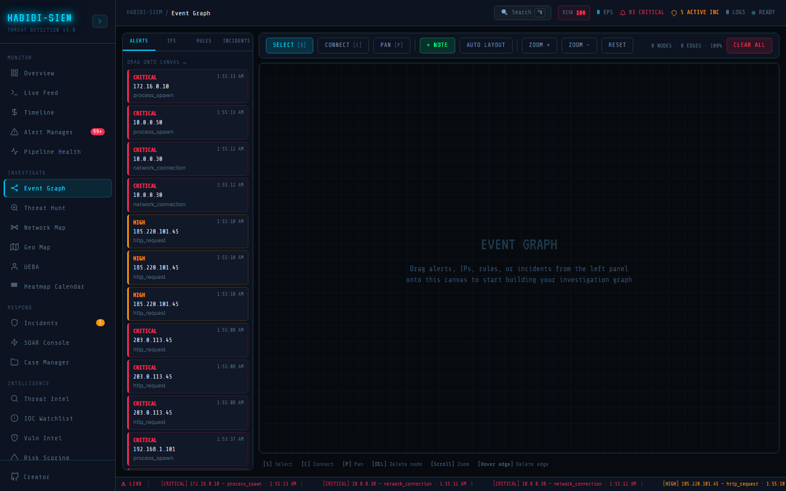

# Graph filtering

**Sidebar path:** Investigate → Event Graph

### What you are looking at

Filtering is achieved through sidebar tab selection (only alerts, only IPs, etc.), canvas zoom (**ZOOM +**, **ZOOM -**, scroll wheel, **RESET**), and interaction modes (**SELECT**, **CONNECT**, **PAN**). The toolbar shows `{nodes.length} NODES · {edges.length} EDGES · {Math.round(zoom * 100)}%`. **CLEAR ALL** wipes the entire workspace. **AUTO LAYOUT** recomputes positions. There is no time-window slider or severity filter built into this module, those exist in Threat Hunt, Network Map, and Alert Manager.

### What is happening underneath

Mode state (`mode: 'select' | 'connect' | 'pan'`) gates mouse behaviour in `onNodeMouseDown` and `onSvgMouseDown`. Zoom clamps between 0.2 and 3.0 via wheel delta. Pan updates `pan.x`/`pan.y` translating the SVG group. Tab switching (`sidebar: 'alerts'|'ips'|'rules'|'incidents'`) only changes the left list, it does not filter canvas nodes. `clearCanvas` resets nodes, edges, selection, and connecting state.

### Why this matters

Investigation graphs become unreadable without noise reduction. Even manual graphs need view controls: zoom into a cluster, pan across a wide layout, switch sidebar tabs to find the next entity type efficiently. Enterprise tools add time sliders and entity-type filters; this lab implements the necessary navigation primitives.

### Step-by-step walkthrough

1. Build a graph with 8+ nodes.
2. Press P or click **PAN**; drag the canvas background to reposition.
3. Scroll to zoom into a cluster; click **RESET** to restore default view.
4. Switch sidebar tabs to find entity types without cluttering the list.
5. Click **AUTO LAYOUT** when overlapping nodes obscure edges.
6. Use **SELECT** mode to click individual nodes for **NODE DETAIL**.
7. Use **CLEAR ALL** only when starting a fresh investigation.

### Common questions

#### Can I filter by severity on the graph?

Not directly. Drag only critical alerts from the **ALERTS** tab (severity-coloured borders help visually), or pre-filter in Threat Hunt and cross-reference alert IDs.

#### Why does AUTO LAYOUT ignore my careful placement?

It applies a uniform radial formula, every node gets equal angular spacing. Use it for discovery, then manually adjust in **SELECT** mode.

#### What's the keyboard shortcut cheat sheet?

The footer shows: [S] Select, [C] Connect, [P] Pan, [DEL] Delete node, [Scroll] Zoom, [Hover edge] Delete edge. Escape cancels connect mode.

#### Can I export the graph?

No export button exists in this module. Screenshot the canvas or document connections in Respond → Case Manager.

### What analysts do when the pager fires

During a crowded war room, one analyst manages the view: zooming the relevant cluster for the briefing, resetting when switching investigation threads, running **AUTO LAYOUT** when the CEO walks in. Sidebar tab discipline keeps the palette manageable; **IPS** tab during lateral movement analysis, **RULES** tab during detection tuning discussions.

### Edge cases and gotchas

**CLEAR ALL** is destructive with no undo. Zoom below 20% makes node text illegible. Pan mode with trackpad may conflict with browser navigation gestures. **CONNECT** mode still allows accidental node drags if you miss-click; watch for the crosshair cursor.

### Composing with other investigate filters

Because Event Graph lacks built-in severity filters, analysts often pre-filter mentally using Threat Hunt results: hunt for `severity in high,critical`, note matching source IPs, then drag only those IPs and alerts from sidebar tabs. Network Map **CRITICAL** filter provides complementary IP prioritisation; cross-reference high-volume critical IPs on the map with graph hub nodes. For time-bounded investigations, read timestamps in **NODE DETAIL** and exclude nodes outside the incident window manually, no time slider exists here. Keyboard-first analysts use **S/C/P** mode keys and Delete for rapid workspace grooming during live calls when mouse precision is awkward on a projected war-room screen.

### Communicating graph filtering to leadership and engineering

For board conversations, frame Investigate → Event Graph numbers as risk to revenue and reputation. For engineering reviews, reference the component file and `the SIEM context pipeline` fields listed in the walkthrough. Keep artefacts: PNG exports beat memory.

### Reading paths for analysts and engineers

This page keeps UI strings explicit so operators can follow the walkthrough without guessing field names.

#### How would you summarise graph filtering for leadership in under two minutes?

Lead with the stat strip or dominant visual on Investigate → Event Graph. Compare today's numbers to your last briefing slide if possible. Name the business process at risk, not the detection rule ID. Offer one mitigation already underway and one that needs approval. Reserve technical detail for the appendix.

#### What integration tests guard graph filtering behaviour?

Locate the matching component under `dashboard screens` and confirm field names in the UI match the `the SIEM context pipeline` alert and log schema. Breakpoints and filters described here should align with local screen state, `useMemo`, and render branches, if the code changed, update this document. Trace data from the ingest API through the parser to the context provider so hunt queries, graph drag payloads, and map aggregations stay consistent. Add integration tests when altering normalisation because every Investigate module consumes the same alert objects.

#### What should newcomers avoid on this view?

Assuming empty or quiet means safe. Verify ingestion in Pipeline Health and rule hits on Overview before telling stakeholders the environment is clean.
