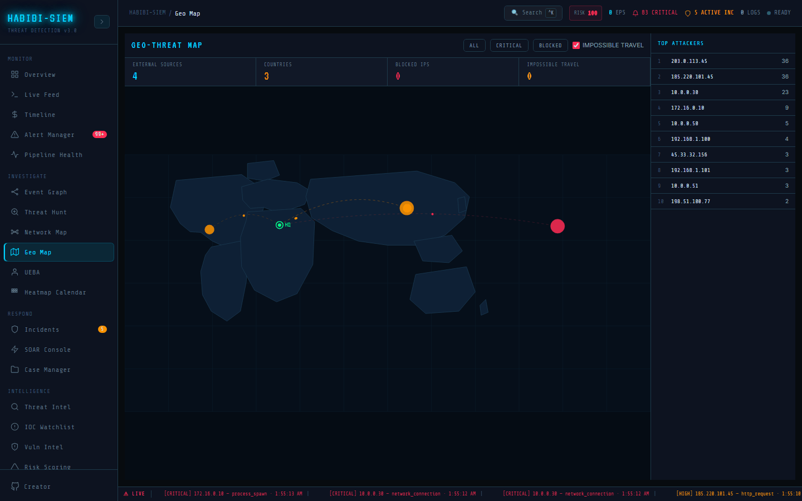

# Impossible travel detection

**Sidebar path:** Investigate → Geo Map

### What you are looking at

With **impossible travel** checked (default on), red dashed Bézier lines connect two geographic points with username label at midpoint. Right panel bottom section impossible travel (N) lists up to three entries showing user, city pair (`London → Tokyo`), distance km and time minutes. Stat strip **impossible travel** counter matches detection count.

### What is happening underneath

Algorithm groups alerts by `username` (or `source.user.name`), sorts by timestamp, compares consecutive pairs. For each pair, `haversineKm(prev.geo, curr.geo)` calculates great-circle distance; `(curr.ts - prev.ts) / 60000` gives minutes elapsed. Flag when `km > IMPOSSIBLE_TRAVEL_KM && mins < IMPOSSIBLE_TRAVEL_MINS` (constants in geo data module). Skips anonymous users and internal geo.country. Independent of map node clicks, renders all flagged pairs simultaneously.

> **Technical note:** Haversine formula calculates shortest path on Earth sphere: `d = 2R × arcsin(√(sin²(Δlat/2) + cos(lat1)cos(lat2)sin²(Δlon/2)))`. Typical thresholds: 500km in 30 minutes, tunable in geoData constants.

### Why this matters

Credential theft manifests as same account authenticating from distant locations impossibly fast. Physics-based detection catches what rule-based "login from new country" misses when timing is the signal. Banks use similar logic for card fraud; Microsoft Entra ID calls it "impossible travel risk."

### Step-by-step walkthrough

1. Ensure alerts include varied usernames with geo-enriched timestamps.
2. Open Geo Map with **impossible travel** enabled.
3. Observe red inter-city dashed lines if detections exist.
4. Read bottom panel cards, note user, cities, km, minutes.
5. Cross-reference user in Investigate → UEBA for anomaly score.
6. Toggle checkbox off; lines disappear (verification).
7. Document finding in incident case with km/min evidence.

### Common questions

#### How can the system know travel is impossible?

It calculates distance between login geo-coordinates and divides by time elapsed. If required speed exceeds commercial flight capability (threshold in km/min), flag triggers. It does not know about VPNs; false positives happen.

#### Why was my executive flagged after VPN use?

VPN exit nodes change apparent location instantly; classic false positive. Annotate expected VPN usage in user profile (production feature) or whitelist corporate VPN egress IPs.

#### Does impossible travel auto-block accounts?

No in this lab, visual alert only. Production IAM integrations would trigger MFA challenge or lockout via SOAR.

#### What users are analysed?

Any non-anonymous username on alerts with resolvable non-internal geo. Service accounts with shared logins may false-flag; investigate context.

### What analysts do when the pager fires

Account compromise hypothesis: check impossible travel panel first. Validate user with HR/travel schedule. If unexplained, force password reset and session revoke via Respond → SOAR Console playbooks. Link UEBA anomaly score for corroboration.

### Edge cases and gotchas

Simulated demo data may not generate impossible travel; count stays zero legitimately. Single login per user yields no pairs. Geo inaccuracy can false-flag adjacent cities incorrectly. Internal geo skipped entirely.

### Threshold constants and tuning philosophy

Flag condition: distance exceeds `IMPOSSIBLE_TRAVEL_KM` within `IMPOSSIBLE_TRAVEL_MINS` minutes (defined in geo data module). Pairwise comparison on consecutive user events sorted by timestamp. O(n) per user. VPN false positives are expected; production adds MFA step-up rather than immediate lockout on flag alone. Service accounts with concurrent sessions from multiple regions may flag constantly, exclude or annotate in runbooks. Cross-reference flagged users with **UEBA** anomaly score for composite confidence before HR engagement.

### Communicating impossible travel to leadership and engineering

Executives want impact and cost; developers want schema and file paths. Treat these one-line phrases as starting points and adapt to the meeting in the room. On Investigate → Geo Map, read labels aloud from the UI and record them in case notes when legal may review the incident.

### Two readers, one screen

Use the walkthrough if you run the SOC; use the source tree if you ship the code. Both paths describe the same Investigate → Geo Map behaviour at different altitudes.

#### What talking points cover impossible travel for senior leadership?

Open Investigate → Geo Map on the live dashboard during the meeting. Point to the primary visual described in the opening section; skip raw log lines. State how many items are flagged, whether the pattern is new or recurring (compare to yesterday's screenshot if you have one), and name one concrete next action (block IP, reset credential, open case). Boards decide on risk and resources, not MITRE techniques, so translate findings into business impact and recommended spend. Close with what remains unknown and when you will update them.

#### How do maintainers validate impossible travel against the live UI?

Engineers should grep for the sidebar label `Investigate → Geo Map` in global header, open the routed component, and verify each bold UI string in this page still exists. Parser changes require a spot-check in Monitor → Live Feed because Investigate views inherit the same normalised objects.

#### Which mistake do new analysts make most often here?

Over-trusting a single panel on Investigate → Geo Map. Severity colour ranks items against each other in memory, not against ground truth. Confirm with another view, then document in a case. Also save or screenshot before refresh; many Investigate tools keep state only in the browser session.
