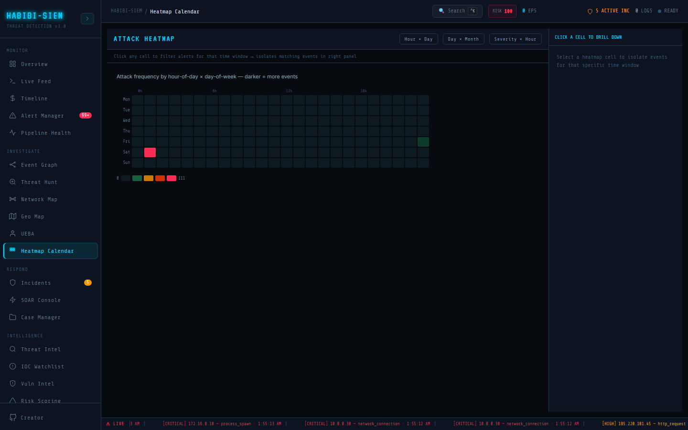

# What a Heatmap Calendar is

**Sidebar path:** Investigate → Heatmap Calendar

### What you are looking at

Header **ATTACK HEATMAP** with mode buttons Hour × Day, Day × Month, Severity × Hour. Hint bar: "Click any cell to filter alerts for that time window → isolates matching events in right panel." Main canvas shows colour grids or stacked bar chart depending on mode. Right panel header toggles **CLICK A CELL TO DRILL DOWN** or FILTERED EVENTS (N) listing up to 20 matching alerts with severity badge, time, source IP, and rule/event type.

### What is happening underneath

Three visualisation modes share `alerts` from the SIEM context pipeline. Hour × Day builds 7×24 matrix (Mon–Sun rows, 0–23 hour columns) counting alerts by local timestamp. Day × Month builds 12×31 matrix rolling months. Severity × Hour stacks critical/high/medium/low counts per hour in vertical bars. Colour scale via `heatColor(val, max)` from dark `#0d1a22` (zero) through green/orange/red to `#ff2d55` at peak. Cell click sets `focusTime` object filtering `focusedAlerts`.

> **Technical note:** GitHub contribution graph analogy is exact, each cell is temporal bucket intensity, not individual event glyph.

### Why this matters

Live feeds show *that* events happened; heatmaps show *when* they cluster. Human attackers sleep; automated attacks don't, but operators schedule maintenance windows attackers exploit. Slow drip exfil (3 events/day) hides in feeds; six weeks × 3/day jumps out as sustained warm column on Day × Month view.

### Step-by-step walkthrough

1. Open Investigate → Heatmap Calendar (sidebar may label Heatmap).
2. Default Hour × Day view loads, scan for orange/red cells.
3. Hover cell; tooltip shows day, hour, count.
4. Click hot cell: right panel lists **FILTERED EVENTS**.
5. Switch to Day × Month; look for multi-day streaks.
6. Switch to Severity × Hour, see if criticals cluster overnight.
7. Click same cell again to clear filter (toggle deselect).

### Common questions

#### Is this like GitHub's green squares?

Yes; same visual grammar. Light/dark (here green→red) encodes activity intensity per time bucket. Security version colours by alert count or severity instead of commit count.

#### What does each cell represent?

Hour × Day: one hour block one weekday. Day × Month: one calendar day one month. Severity × Hour: one hour's severity breakdown stacked.

#### Why three modes?

Different time grains reveal different patterns; weekly shift cycles (hour×day), campaign duration (day×month), severity timing (severity×hour).

#### Can I export the heatmap?

No export button; screenshot for reports. Use Reporting → Reports for formal output.

### Operational use during containment

Determine if current attack is isolated spike or part of longer campaign, switch Day × Month, click streak days, read filtered events for consistent source IPs across days.

### Edge cases and gotchas

Empty grid if no alerts; ingest or simulate first. Month index calculation uses rolling 12-month window relative to now; edge dates near month boundaries need careful reading. Focus panel caps at 20 events; not exhaustive list.

### Three modes as complementary lenses

Hour × Day answers "which hours on which weekdays?", shift staffing decisions. Day × Month answers "which calendar days carried sustained activity?"; campaign duration. Severity × Hour answers "when do criticals concentrate?"; executive severity timing. Mode switch clears `focusTime`; deliberate reset preventing stale filter confusion. Right panel caps at 20 events, tooltip hover on hour×day cells shows true count when exceeding 20.

### Communicating heatmap concept to leadership and engineering

Leadership briefings on Investigate → Heatmap Calendar should tie each KPI to a business owner. Technical stakeholders need the ingest → context → component path spelled out. Screenshot the stat strip with timestamps when evidence may be challenged later.

### Reading paths for analysts and engineers

Analyst readers: stay on-screen labels and the step list above. Maintainer readers: validate the screen against this prose before release. Enterprise deployments add scale; the interaction patterns here still apply.

#### What is the elevator pitch for heatmap concept when briefing the board?

Share your screen on Investigate → Heatmap Calendar and anchor the conversation on the headline counters visible without scrolling. Give counts, severity mix, and whether the activity is isolated or spreading. Recommend a single decision: budget, block, or escalate. Avoid acronyms unless the room already uses them. End with a time-bound follow-up.

#### How do maintainers validate heatmap concept against the live UI?

Engineers should grep for the sidebar label `Investigate → Heatmap Calendar` in global header, open the routed component, and verify each bold UI string in this page still exists. Parser changes require a spot-check in Monitor → Live Feed because Investigate views inherit the same normalised objects.

#### Which mistake do new analysts make most often here?

Assuming empty or quiet means safe. Verify ingestion in Pipeline Health and rule hits on Overview before telling stakeholders the environment is clean.
