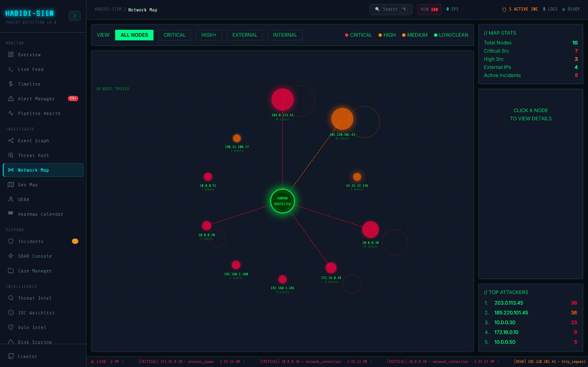

# Clicking through to raw event logs

**Sidebar path:** Investigate → Network Map

### What you are looking at

Clicking a node toggles selection (click again deselects). // NODE DETAIL shows IP, classification, top severity, alert count, threat score bar, event type tags, and linked incidents. // TOP ATTACKERS list items are click shortcuts to select nodes. No in-module "view logs" button exists.

### What is happening underneath

Selection state: `selected` holds IP string; `selectedNode` finds matching object in `filtered` array. Pivot path: copy IP → Threat Hunt (`sourceIp equals`), Geo Map (click matching top attacker), Event Graph (drag from IPS tab), Live Feed (search raw logs). Incident cards show `status`, `alertCount`, `ruleNames.join(', ')`.

### Why this matters

Visual discovery must chain to evidentiary modules. The map answers "who stands out?", logs answer "prove it." Skipping pivot leaves decisions based on bubble size alone, which is indefensible in post-incident review.

### Step-by-step walkthrough

1. Select node from map or **TOP ATTACKERS** list.
2. Copy IP from **IP ADDRESS** field.
3. Open Investigate → Threat Hunt. Query `sourceIp equals <ip>`.
4. Open Investigate → Geo Map, find IP in right panel list, click for detail.
5. Open Investigate → Event Graph; drag IP from **IPS** tab, connect related alerts.
6. Open Monitor → Live Feed: search timestamp range from hunt results.
7. Return to map; deselect click again or select next node.

### Common questions

#### Is there a direct link to raw logs?

No automatic deep link. Manual search using IP and timestamps from Threat Hunt results.

#### Can I create an incident from the map?

No button, use Respond → Incidents manually, referencing map findings. Incidents already linked show in **INCIDENTS** detail section.

#### Does clicking a node block the IP?

No; read-only visualisation. Blocking requires Watchlist or SOAR actions.

#### Why do incident rule names truncate?

`truncate` CSS on joined rule names; open full incident in Respond → Incidents for complete list.

### Operational use during containment

Map → Hunt → Graph → Case is the standard loop. Analyst selects pulsing node, hunts all alerts from IP, graphs relationships, attaches screenshots and IP evidence to Case Manager. Each pivot takes under two minutes with practice.

### Edge cases and gotchas

Deselect by clicking same node twice; detail panel returns to placeholder text. Filtering hides selected node if it no longer matches, selection may appear empty. Incident section empty does not mean no alerts; incidents may not yet be created from alert cluster.

### Five-minute pivot SLA during incidents

Set a team norm: no node selected on Network Map for more than five minutes without either opening **NODE DETAIL** investigation or deselecting as reviewed. Each selected node should produce one of: block recommendation, hunt query, graph node, or documented false positive. **TOP ATTACKERS** click-through exists precisely to reduce friction; use it instead of hunting visually for the largest dot when under time pressure.

### Communicating click-through to logs to leadership and engineering

Executives want impact and cost; developers want schema and file paths. Treat these one-line phrases as starting points and adapt to the meeting in the room. On Investigate → Network Map, read labels aloud from the UI and record them in case notes when legal may review the incident.

### Two readers, one screen

Analyst readers: stay on-screen labels and the step list above. Maintainer readers: validate the screen against this prose before release. Enterprise deployments add scale; the interaction patterns here still apply.

#### What should executives hear first about click-through to logs?

Use Investigate → Network Map as a prop, not a tutorial. Highlight the top three labelled fields that changed since yesterday. Explain customer or revenue exposure in plain language. Request only the decision you need today. Document the screen with timestamp for the minutes.

#### How do maintainers validate click-through to logs against the live UI?

Engineers should grep for the sidebar label `Investigate → Network Map` in global header, open the routed component, and verify each bold UI string in this page still exists. Parser changes require a spot-check in Monitor → Live Feed because Investigate views inherit the same normalised objects.

#### What is the most common beginner mistake on this screen?

Over-trusting a single panel on Investigate → Network Map. Severity colour ranks items against each other in memory, not against ground truth. Confirm with another view, then document in a case. Also save or screenshot before refresh; many Investigate tools keep state only in the browser session.
