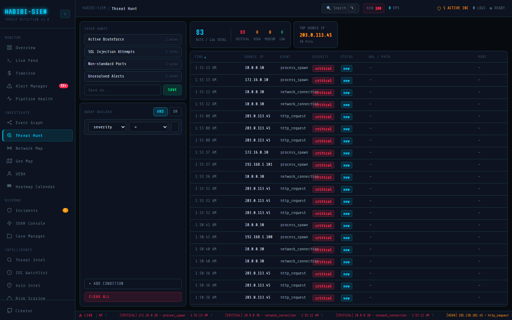

# The philosophy of threat hunting

**Sidebar path:** Investigate → Threat Hunt

### What you are looking at

Threat Hunt uses a three-column layout. The left column (300px) holds **SAVED HUNTS** at the top, clickable preset buttons showing hunt name and rule count, and a **QUERY BUILDER** below with **AND** / **OR** logic toggles, stacked condition rows, **+ ADD CONDITION**, and **CLEAR ALL**. The centre column shows a stats strip (large cyan hit count, severity breakdown, **TOP SOURCE IP** card) above a sortable results grid with columns **TIME**, **SOURCE IP**, **EVENT**, **SEVERITY**, **STATUS**, **URL / PATH**, and **PORT**. The right column (**ALERT DETAIL**, 240px) appears when you click a result row, listing all alert fields and **MATCHED RULES** if present.

### What is happening underneath

Threat Hunt filters the in-memory `alerts` array from the SIEM context pipeline, it does not query SQLite directly from the browser. Each condition row evaluates via `evaluateRule(alert, rule)` using case-insensitive string comparison or numeric parsing. Logic mode (`AND` | `OR`) combines condition results. Results re-sort on column header click via `toggleSort`. Saved hunts merge hardcoded `SAVED_HUNTS` presets with user-saved hunts in session state (`userSaved`). There is no scheduled execution; hunts run immediately on every state change through `useMemo`.

> **Technical note:** `FIELD_OPTIONS` includes sourceIp, eventType, severity, status, method, url, port, username, statusCode. Operators vary by field. For example, port supports `gt`, `lt`, `not_equals`; severity supports `in` with comma-separated values.

### Why this matters

Alerts are reactive; they fire when rules match. Threat hunting is ahead-of-time, you assume something bad may already be present and go looking. The SANS Institute defines hunting as "a focused and iterative approach to search out, identify and understand adversaries." Waiting for a critical alert during a stealthy insider exfiltration could mean weeks of undetected data loss. This module teaches the query-building mindset even in a lab dataset.

### Step-by-step walkthrough

1. Open Investigate → Threat Hunt.
2. If hits show `0 / 0 TOTAL`, run Simulate Campaign on Overview or ingest logs.
3. Click the preset Active Bruteforce under **SAVED HUNTS**.
4. Observe the stats strip update and results populate.
5. Click a result row; read **ALERT DETAIL** on the right.
6. Modify a condition value; watch results filter live.
7. Enter a name in Save as... and click **SAVE** to preserve your hunt.

### Common questions

#### What is the difference between hunting and just using alert manager?

Alert Manager triages what already fired loudly. Threat Hunt searches the entire alert pool; including low-severity events that might be puzzle pieces. Think of Alert Manager as your fire alarm panel and Threat Hunt as a flashlight search of the building after someone smelled smoke but no alarm rang.

#### What does "assume breach" mean?

It means you operate as if an attacker is already inside, rather than waiting for proof. You hunt for subtle indicators (odd ports, unresolved high-severity alerts, auth failures) instead of assuming the perimeter held. This module supports that mindset with open-ended queries.

#### Is this real-time hunting?

Results refresh whenever `alerts` in context changes (new ingest, simulation). There is no background scheduler, you are always looking at the current in-memory snapshot.

#### Can non-technical users use this?

Yes. Start with **SAVED HUNTS** presets; each is a pre-built question like "show me unresolved critical alerts." Read the hit count and severity breakdown without touching the query builder.

### What analysts do when the pager fires

When the SOC suspects lateral movement but only has one medium alert, the analyst opens Threat Hunt, loads Non-standard Ports, and scans for unexpected port values highlighted in yellow (`#ffd60a`). They pivot to **TOP SOURCE IP** for concentration, click rows for **ALERT DETAIL**, and cross-reference IPs in Network Map. Hunting runs parallel to reactive triage and finds supporting evidence the initial alert missed.

### Edge cases and gotchas

Empty `queryRules` returns all alerts unfiltered. **CLEAR ALL** removes conditions entirely, which can flood the grid. User-saved hunts persist only for the browser session. The `in` operator splits on commas with no space trimming beyond `trim()` per segment. Numeric operators on non-numeric fields return false silently.

### How threat hunt normalises data before you query

Every row in the results grid is a normalised alert object, not a raw syslog line. A Windows Security Event describing logon failure might arrive as JSON with `event.action: "logon-failure"`; the parser maps it to `eventType: "auth-failure"` and `severity: "high"` so your hunt condition `eventType equals auth-failure` matches consistently across Linux sshd and Windows sources. The **URL / PATH** column displays `alert.url` when present, otherwise falls back to `username`, a UI convenience when web attacks include URLs but auth events include usernames instead. The **PORT** column highlights non-standard ports in yellow (`#ffd60a`) when port is neither 80 nor 443, drawing your eye during Non-standard Ports hunts without requiring a separate visualisation. Understanding these mappings prevents false empty results when you hunt for raw log substrings that were renamed during ingest. Hunting maturity progresses through three stages this module mirrors: (1) running **SAVED HUNTS** presets weekly, (2) modifying presets with additional conditions, (3) authoring entirely new hunts and saving them. Organisations stuck at stage one still benefit; presets encode professional hunt patterns. Stage three analysts feed detection engineering with validated queries converted to rules.
