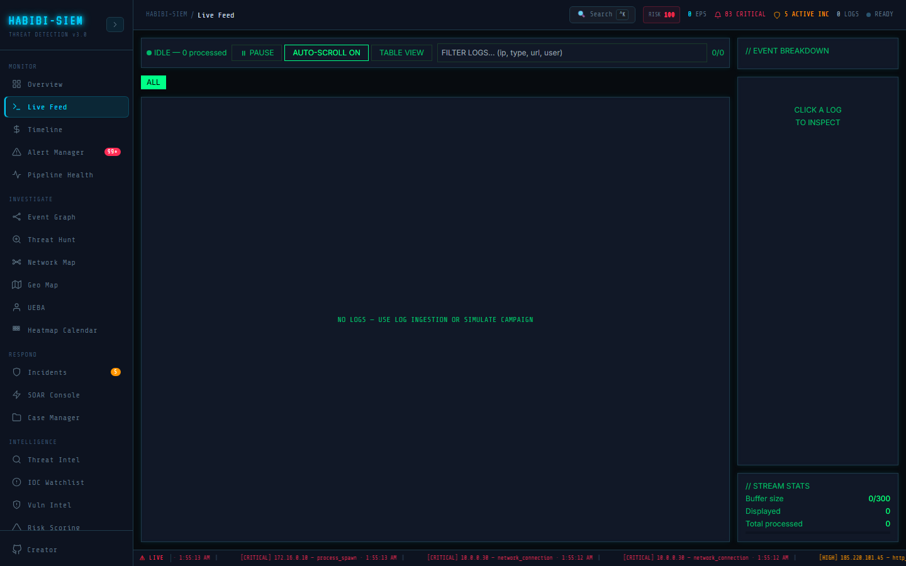

# What a live feed is in SIEM terms

**Part of:** Monitor → Live Feed
**One-sentence focus:** Live Feed shows the last buffered normalized events as they arrive, raw telemetry before and beside alert correlation.

### What you are looking at

Monitor → Live Feed mounts Live Feed screen as a two-pane layout. The main pane toolbar shows a pulsing green dot when **LIVE** (logs flowing and not paused), grey when **IDLE** or **PAUSED**, plus text `{status}. {logsProcessed} processed`. Control buttons: **PAUSE** / **RESUME**, **AUTO-SCROLL ON/OFF**, **TABLE VIEW / STREAM VIEW**. A wide filter input placeholder reads `FILTER LOGS... (ip, type, url, user)`. Event-type pills appear below (`ALL`, `http-request`, `login-attempt`, etc.) with counts. The log area shows monospace rows or a table. Right sidebar panels: // EVENT BREAKDOWN, // LOG DETAIL, // STREAM STATS (buffer `N/300`, displayed count, total processed). A social media feed shows you posts from people you follow in roughly chronological order, and you scroll to see what happened recently. A SIEM live feed is similar on the surface, newest events at the bottom with auto-scroll, but every "post" is a machine-generated security event, there is no algorithmic ranking, and missing one line can mean missing the first sign of breach. The analogy breaks down where stakes and volume differ: Twitter throttles your timeline; a SIEM must not silently drop security telemetry without telling you.

### What is happening underneath

`rawLogs` lives in the SIEM context pipeline as an array capped at `MAX_RAW_LOGS` (500 in context; UI stats label shows `/300` in Live Feed screen display; the buffer bar uses 300 as visual denominator). Each `processLogs()` call appends geo-enriched events and slices the tail. Live Feed reads `rawLogs` and `logsProcessed` via the SIEM context pipeline; it does not fetch independently. Pause copies `rawLogs` into `frozen` state on toggle so display freezes while ingestion continues in background. Auto-scroll calls `bottomRef.scrollIntoView({ behavior: 'smooth' })` when new logs arrive unless paused. Stream vs table toggles rendering only; same `filtered` array backs both.

### Why this matters

Alerts tell you what rules think is wrong; the live feed shows what actually happened. During investigations, analysts must verify false positives, see precursor events that did not trigger rules, and capture evidence before buffer rotation drops old lines. Regulators and insurers increasingly ask for raw log retention narratives, Live Feed is the in-session window into that stream.

### Step-by-step walkthrough

1. Open Monitor → Live Feed after starting ingestion or simulation.
2. Confirm toolbar shows **LIVE** with pulsing dot and rising processed count.
3. Leave **AUTO-SCROLL ON** to follow the tail; click a row to inspect // LOG DETAIL.
4. Type an IP fragment in the filter box to narrow rows instantly.
5. Click an event-type pill (e.g. `auth-failure`) to isolate that class.
6. Hit **PAUSE** to freeze the view for screenshot or copy without losing incoming data.
7. Switch **TABLE VIEW** for columnar sort-friendly review.
8. Compare // EVENT BREAKDOWN percentages to filter pills for volume context.

### Common questions

#### Is live feed the same as alerts?

No. Most log lines never become alerts. Only events matching enabled detection rules in `detection engine` produce alert objects visible on Overview. Live Feed shows normalized logs regardless of rule hits.

#### Why does it say NO LOGS when overview has alerts?

Alerts persist in SQLite across sessions; `rawLogs` buffer is in-memory and clears on page reload or **CLEAR ALL** (admin). Re-ingest or simulate to refill the stream. Historical alerts without current buffer is normal after refresh.

#### Can I export the live feed?

Not from this screen directly. Use Overview → JSON EXPORT for alerts or Ingest source files for raw retention. Live Feed is operational viewing, not archival export.

#### Who can pause the feed?

Any authenticated user with Live Feed access; pause is local UI state, not RBAC-gated. It does not stop server ingestion.

### Operational use during containment

In the first five minutes, analysts keep Live Feed open alongside Overview. They filter on the suspicious source IP seen in a critical alert, pause once the burst appears, and read preceding event types (e.g. `port-scan` before `auth-failure`). They click rows to copy full JSON fields from **LOG DETAIL** into incident notes. Auto-scroll stays on until they need stable lines for correlation, then pause for documentation.

### Edge cases and gotchas

`formatLogSummary()` must handle ECS objects (`url` and `file` may be `{path, full}` objects; rendering them raw in the UI would crash the view. Filter searches `JSON.stringify(l)` as fallback, but slow on huge buffers. Index keys use array index `key={i}`, reordering filters changes indices; selected row may jump. Buffer size label `300` vs context `500` is a display inconsistency; trust `rawLogs.length` for actual cap behaviour after context slice.

> **Technical note:** Live Feed does not subscribe to Server-Sent Events; it reflects whatever `processLogs()` already pushed into dashboard state on this client.
