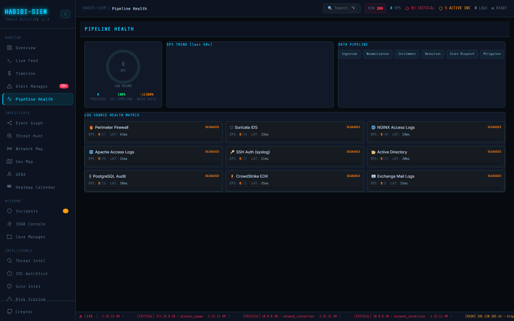

# What the pipeline means end to end

**Part of:** Monitor → Pipeline Health
**One-sentence focus:** Pipeline Health labels the logical stages from ingestion through mitigation that processLogs() executes in one monolithic demo path.

### What you are looking at

Header **PIPELINE HEALTH** in display font. Top row cards: circular EPS gauge with numeric centre and LOW VOLUME / NOMINAL / ELEVATED / CRITICAL LOAD label; EPS TREND (last 60s) sparkline; **DATA PIPELINE** stage chips Ingestion → Normalization → Enrichment → Detection → Alert Dispatch → Mitigation (clickable). Sub-metrics under gauge: **PROCESSED**, **ECS COMPLIANT** %, **NOISE RATIO** %. Bottom **LOG SOURCE HEALTH MATRIX** grid (3 columns) listing nine named sources with icon, health badge, EPS actual/expected, latency ms, progress bar. A factory assembly line moves raw materials through stamping, painting, QA, packaging, each station must run or finished products never ship. The SIEM pipeline is that line for security events: raw logs enter, get shaped, enriched, evaluated, displayed, optionally blocked.

### What is happening underneath

Real metrics from the SIEM context pipeline: `eps`, `epsHistory`, `logsProcessed`, `rawLogs`, `alerts`. Stages are descriptive UI (`PIPELINE_STAGES` constant), clicking shows `desc` text and conditional extras (ECS % on normalize, alert ratio on detect). Log sources (`LOG_SOURCES` array) simulate health via `useMemo` splitting total `eps` proportionally with random jitter, illustrative not live SNMP. Actual pipeline execution occurs in `processLogs()`: validate → geo enrich → buffer → detection → alert persist → optional SOAR.

### Why this matters

Detection is useless if ingestion silently fails. Attackers know this; disable logging first. Pipeline view answers "are we blind?" before "are we hacked?"

### Step-by-step walkthrough

1. Open Monitor → Pipeline Health with ingestion running.
2. Read EPS gauge colour (cyan nominal, orange elevated, red critical load).
3. Click each pipeline stage: read description panel.
4. Scan source matrix for DEGRADED or OVERLOAD badges.
5. Cross-check **PROCESSED** counter increasing on refresh/re-render.
6. Compare **ECS COMPLIANT**; sub-90% triggers parser review.
7. If EPS zero, jump Ingest → Log Ingestion before threat hunting.

### Common questions

#### Are pipeline stages separate servers?

No, monolithic Node/React demo path; stages label logical phases in one log processing call.

#### Is log source data real?

EPS is distributed proportionally across sources from the total ingestion rate; source names reflect common enterprise log producers (NGINX, Suricata, AD) labelled for operational context.

#### What starts the pipeline?

Log Ingestion UI, API validate endpoint, or Simulate Campaign calling `processLogs()`.

#### Where is mitigation?

AbuseIPDB + watchlist via `soarCheckIp` and `blockIp`; triggered post-detection on high severity external IPs.

### How an analyst uses this during an active incident

If alerts suddenly stop during known attack, check EPS trend drop; may indicate ingestion failure not attacker pause. Escalate DevOps if source shows DEGRADED.

### Edge cases and gotchas

Random jitter in source stats changes on re-render, do not treat latency ms as stable SLO measurement. Empty buffer shows ECS 100% vacuously true.

> **Technical note:** `EPS_WINDOW_MS = 5000` and history length 60 buckets drive gauge and sparkline. Clicking pipeline stage chips in Pipeline Health screen reveals `desc` text from the `PIPELINE_STAGES` constant. Normalization stage shows ECS compliance % when selected; Detection stage shows alerts-raised ratio. All stages execute inside `processLogs()` on a single client-server round trip; they are logical labels, not separate microservices. Mitigation stage triggers automatic IP enrichment on critical/high external alerts when AbuseIPDB keys are configured, and may auto-watchlist IPs scoring above `SOAR_THRESHOLD = 75`. Failure of SOAR APIs does not stop ingestion but affects downstream response visibility in Respond → SOAR Console.
