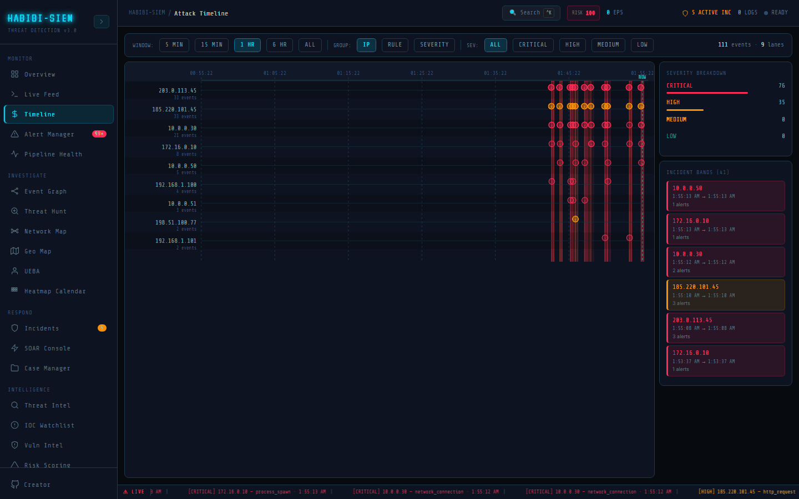

# What a kill chain is

**Part of:** Monitor → Attack Timeline
**One-sentence focus:** Attack Timeline plots alert timestamps on swim lanes so analysts see attack progression even when the UI does not label kill-chain phases explicitly.

### What you are looking at

Monitor → Timeline renders Attack Timeline screen: toolbar with **WINDOW:** buttons (**5 MIN**, **15 MIN**, **1 HR**, **6 HR**, **ALL**), **GROUP:** (**IP**, **RULE**, **SEVERITY**), **SEV:** filters, and counter `{N} events · {M} lanes`. Main SVG canvas shows time axis, vertical grid ticks, green dashed **NOW** line, optional red/orange incident bands, and per-lane event dots with severity colours. Right panel: **SEVERITY BREAKDOWN**, **INCIDENT BANDS**, **SELECTED EVENT** or **HOVERED EVENT** detail. The Lockheed Martin Cyber Kill Chain models an intrusion as ordered stages: reconnaissance, weaponisation, delivery, exploitation, installation, command-and-control, actions on objectives, like a burglar casing a house, picking a lock, entering, and stealing a safe. HABIBI-SIEM does not label lanes with kill-chain phase names explicitly; instead, matched rule categories (brute-force, sql-injection, data-exfil, etc.) imply phases when you group by **RULE** or read alert metadata.

### What is happening underneath

Timeline data source is `alerts` from the SIEM context pipeline, not raw logs. Each alert carries `timestamp`, `severity`, `sourceIp`, `matchedRules[]`. Incidents from `correlateAlerts()` render as translucent vertical bands when `firstSeen >= minTime`. Kill-chain mapping is interpretive: rule categories in the detection rules catalog align to tactics (e.g. brute-force → credential access, data-exfil → exfiltration) but UI does not render MITRE tactic lanes automatically.

### Why this matters

Non-technical leaders ask "what happened first?" not "what is rule ID bf-001?" Timeline translates temporal causality into visual story without log syntax. Training kill-chain thinking helps organisations prioritise controls at each stage; block recon early, prevent exfil late.

### Step-by-step walkthrough

1. Generate alerts via simulate or ingestion.
2. Open Timeline: default window **1 HR**.
3. Select **GROUP: IP**; each lane is one attacker IP.
4. Scan left-to-right for dot clusters, burst indicates activity spike.
5. Switch **GROUP: RULE**; see technique spread over time.
6. Hover dots for quick ID; click to pin **SELECTED EVENT** panel.
7. Read **INCIDENT BANDS** for correlated time spans.

### Common questions

#### Does HABIBI-SIEM show kill chain labels on the chart?

Not as explicit Y-axis stages. Use **GROUP: RULE** and MITRE metadata in alert detail modal for phase mapping.

#### What if I have no alerts?

Empty state: `NO EVENTS IN THIS TIME WINDOW: START INGESTION`. Timeline does not plot raw logs.

#### Is this the lockheed chain or MITRE ATT&CK?

Conceptual education uses Lockheed; rule metadata references MITRE techniques in AlertDetailModal. Timeline itself is time + grouping, not a ATT&CK navigator.

#### Can I animate the attack?

No playback animation; static snapshot refreshed when alerts array updates.

### Analyst workflow under pressure

Analyst sets **WINDOW: 15 MIN** during acute phase, **GROUP: IP** to watch one actor's tempo, switches **SEV: CRITICAL** to remove noise. Incident bands show whether activity is sustained or pulsed; pacing hints automated vs manual attacker.

### Edge cases and gotchas

**ALL** window with zero alerts uses fallback `now - 60_000` minTime, may look empty oddly. Lane labels truncate at 16 chars + ellipsis.

> **Technical note:** Kill chain education is conceptual layer atop alert data; do not assume automatic phase classification without reading `matchedRules[].category`. Attack Timeline reads `alerts` and `incidents` from the SIEM context pipeline; it never plots raw logs. Default window is **1 HR** (third preset in the Attack Timeline time-window list). Toolbar shows `{N} events · {M} lanes` after filters apply. The green dashed **NOW** line anchors recency at the right edge of the SVG canvas. Educators can narrate simulate-campaign output on Timeline while students watch lanes populate: brute-force dots appear first, web exploitation categories follow, exfiltration and privilege-escalation lanes appear last; mirroring kill-chain ordering without explicit phase labels on the Y-axis.
