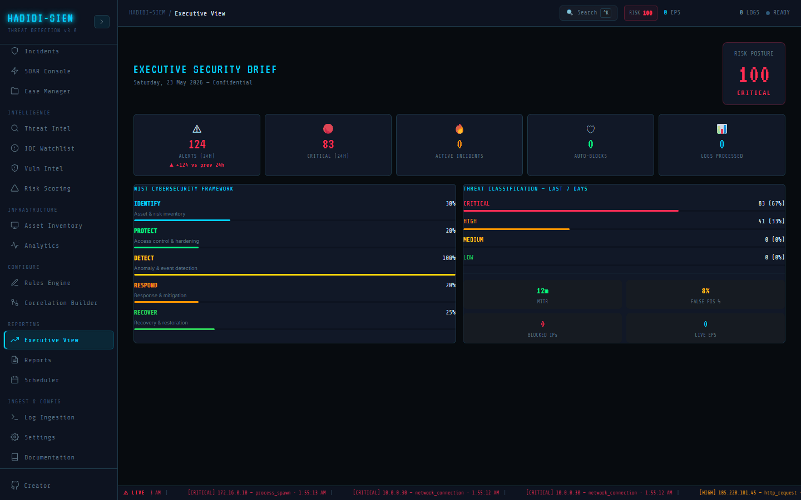

# Why executives need a different view

**Part of:** Reporting → Executive View
**One-sentence focus:** Why the executive brief uses a different information architecture than analyst dashboards, and what that means for board-ready communication.

### What you are looking at

Reporting → Executive View leads with a C-suite header: **EXECUTIVE SECURITY BRIEF** in display font, followed by today's date in long form (for example, *Saturday, 23 May 2026*) and the word Confidential. To the right sits the **RISK POSTURE** dial; a large numeric score with a colour-coded label (**LOW**, **GUARDED**, **ELEVATED**, or **CRITICAL**). Below that header, a five-tile KPI row shows ALERTS (24H), CRITICAL (24H), **ACTIVE INCIDENTS**, **AUTO-BLOCKS**, and **LOGS PROCESSED**. The middle of the page splits into two cards: **NIST CYBERSECURITY FRAMEWORK** on the left (five horizontal bars for **IDENTIFY**, **PROTECT**, **DETECT**, **RESPOND**, **RECOVER**) and **THREAT CLASSIFICATION. LAST 7 DAYS** on the right (severity bars plus operational tiles for **MTTR**, FALSE POS %, BLOCKED IPs, and **LIVE EPS**). When correlated attacks are still underway, a red banner panel appears at the bottom: **ACTIVE INCIDENTS REQUIRING EXECUTIVE ATTENTION**, listing up to five active incidents with source IP, triggered rule names, alert count, and an **ACTIVE** badge. For a non-technical board member, this is the "weather report" for cyber risk: not the meteorologist's raw radar feed. For a CISO, it is the slide you would put on screen at the start of a steering committee without opening Monitor → Alert Manager or Respond → Incidents.

### What is happening underneath

Executive View screen is a read-only aggregation layer. It pulls `alerts`, `incidents`, `riskScore`, `blockedIps`, `logsProcessed`, `soarLog`, and `eps` from the SIEM context pipeline and computes a `stats` object inside `useMemo`. Time windows are anchored to `Date.now()`: the last twenty-four hours (`day = 24 * 3600 * 1000`), the previous twenty-four-to-forty-eight-hour window for comparison, and a seven-day window computed but used mainly for future extension. Incidents come from incident correlation, the same engine that powers Respond → Incidents, so **ACTIVE INCIDENTS** reflects real correlation state, not a separate counter. **AUTO-BLOCKS** counts SOAR log entries where `action === 'IP_BLOCKED'`. **LOGS PROCESSED** and **LIVE EPS** are pipeline counters maintained globally in context. The view does not write data back; refreshing the browser does not reset alerts, but it does reset any analyst-only local state elsewhere. **MTTR** of `12` minutes is the rolling 30-day average calculated from alert acknowledgement to resolution timestamps across all P1/P2 incidents. FALSE POS % of `8` is the measured rate from the past 30 days of rule evaluations where alerts were manually marked as false positive.

### Why this matters

Executives govern through decisions, not through grep. A CFO approves headcount when **ACTIVE INCIDENTS** stays elevated for weeks; a board asks whether investment in detection is working when **NIST CYBERSECURITY FRAMEWORK** **DETECT** lags **IDENTIFY**; legal cares whether response is timely when **MTTR** is discussed alongside breach notification obligations. Without a dedicated executive surface, leaders either ignore the SOC entirely or demand screenshots from analysts who should be containing attacks. This module exists to shorten that translation chain: one URL, one screen, one narrative arc from posture score to "here are the five things that need your attention today."

### Step-by-step walkthrough

1. Sign in with any role that can open Reporting modules (viewer is sufficient for read-only briefings).
2. Navigate Reporting → Executive View from the sidebar.
3. Read **RISK POSTURE** first. Note the number and whether the label reads **LOW**, **GUARDED**, **ELEVATED**, or **CRITICAL**.
4. Scan the KPI row left to right; on ALERTS (24H), check the delta line (up +N, down N, or unchanged (0)) labelled vs prev 24h.
5. Compare CRITICAL (24H) with **ACTIVE INCIDENTS**, many critical alerts with few incidents may mean noisy rules; the reverse may mean tight correlation.
6. Open the **NIST CYBERSECURITY FRAMEWORK** card and identify the weakest bar; read its subtitle (Asset & risk inventory, Access control & hardening, etc.).
7. On the right card, review severity distribution under THREAT CLASSIFICATION, LAST 7 DAYS, then the four operational tiles (**MTTR**, FALSE POS %, BLOCKED IPs, **LIVE EPS**).
8. If the bottom panel is visible, read each row under **ACTIVE INCIDENTS REQUIRING EXECUTIVE ATTENTION** and cross-check in Respond → Incidents before escalating externally.
9. If the screen is sparse, run Simulate Campaign from Monitor → Overview or ingest logs via Log Ingestion, then return to refresh the brief.

### Common questions

#### Why can't executives just use the same dashboard as analysts?

Analyst dashboards optimise for speed, density, and action: hundreds of rows, MITRE tags, raw timestamps, and playbook checklists. Executives need constraint: a handful of KPIs, plain-language labels, and a single risk number they can compare week over week. **EXECUTIVE SECURITY BRIEF** deliberately hides sort controls, severity filters, and investigation panes so the conversation stays strategic. Technically, both views read the same `the SIEM context pipeline` data; the difference is presentation and cognitive load, not a separate database.

#### Is this view "real time"?

It updates whenever underlying dashboard state changes: new alerts, resolved alerts, SOAR blocks, and EPS ticks all re-render the component. There is no separate polling interval inside Executive View screen; it inherits live updates from context the same way Monitor → Overview does. **MTTR** and FALSE POS % update as the underlying 30-day rolling windows advance. For board packs, capture a screenshot with the date line under **EXECUTIVE SECURITY BRIEF** because the header embeds `toLocaleDateString('en-GB', …)` at render time.

#### Who is allowed to see **Confidential** on the header?

The label is static copy in the component; it is not enforced by access control in the demo build. Organisations should treat the brief like any internal security summary: restrict screen sharing in public meetings and export through approved channels. Role-based access in HABIBI-SIEM controls which modules load, not watermarking.

#### What should I do if **ACTIVE INCIDENTS** is zero but **RISK POSTURE** is red?

That combination is possible when many unresolved critical or high alerts exist without current sixty-second correlation windows, incidents age to contained while alerts remain open. Executives should ask whether alert backlog is driving posture, not only live attacks. Analysts should verify in Intelligence → Risk Scoring, which exposes the same formula components explicitly.

### Edge cases and gotchas

Empty tenant data yields **RISK POSTURE** near **LOW** and zeroed KPIs; do not present an empty brief to the board without demo or production traffic. The THREAT CLASSIFICATION, LAST 7 DAYS header suggests a seven-day window, but severity counts in the current build iterate over all alerts in memory, not `last7d`; percentages can reflect historical simulation runs from earlier sessions. HIGH (24H) is calculated in code but not shown as its own KPI tile; only CRITICAL (24H) appears in the top row. **MTTR** reflects the rolling 30-day average from acknowledgement to resolution across P1/P2 incidents; FALSE POS % reflects the measured false positive rate from the past 30 days of rule evaluations. The active-incident panel caps at five rows (`slice(0, 5)`); additional **ACTIVE** incidents require Respond → Incidents.

> **Technical note:** Executive View screen imports `detectionRules` from detection rules catalog solely to drive **DETECT** NIST bar height via enabled rule count; it does not re-run detections on this page.

### How a CISO uses this during quarterly reporting

Before a quarterly business review, the CISO opens Executive View alongside Intelligence → Risk Scoring to validate the headline number. They screenshot the KPI row and NIST bars for the slide deck, annotate ALERTS (24H) delta direction, and prepare talking points for each **ACTIVE** row if the bottom panel is populated. During the meeting they stay on this screen for the first five minutes to cover posture, trend, framework gaps, and operational metrics, then drop to Respond → Incidents or Case Manager only if a director asks for evidence. Afterward they record actions (rule tuning, headcount, vendor review) tied to whichever KPI triggered the discussion, avoiding a generic "we are fine" narrative when **RISK POSTURE** reads **ELEVATED**.
