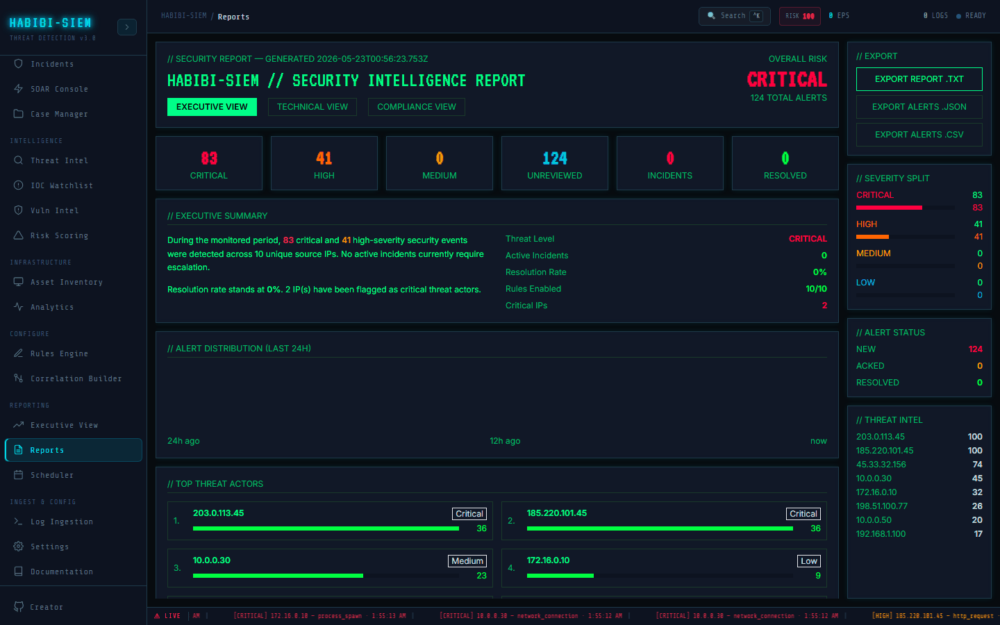

# Report types available

**Part of:** Reporting → Reports
**One-sentence focus:** The three reader-specific report views, executive, technical, and compliance, and who should read each.

### What you are looking at

Reporting → Reports puts the main report canvas on the left and a fixed 208px sidebar on the right (`w-52`). The header panel reads // SECURITY REPORT. GENERATED followed by the current ISO timestamp, then the display title **HABIBI-SIEM // SECURITY INTELLIGENCE REPORT** in large VT323 monospace. Directly beneath the title sit three toggle buttons: **EXECUTIVE VIEW**, **TECHNICAL VIEW**, and **COMPLIANCE VIEW**. The active view uses a solid green matrix background with black bold text; inactive views show dim green borders that brighten on hover. Top-right of the header shows **OVERALL RISK** as a large word; **CRITICAL**, **HIGH**, **MEDIUM**, or **LOW**: colour-coded red through green, plus a subtitle {N} TOTAL ALERTS. Below the header, a six-column KPI strip displays live counters: **CRITICAL**, **HIGH**, **MEDIUM**, **UNREVIEWED** (alerts with status new), **INCIDENTS** (active correlated incidents), and **RESOLVED**. These tiles persist regardless of which view button you select. They are the shared executive heartbeat every reader sees first. Switching views changes the body panels only. Executive View adds // EXECUTIVE SUMMARY (narrative paragraphs plus a metrics sidebar), // ALERT DISTRIBUTION (LAST 24H) (a 24-bar histogram labelled 24h ago, 12h ago, now), and // TOP THREAT ACTORS (up to eight source IPs with mini-bars and optional threat-intel risk badges). Technical View replaces those with // DETECTION RULE PERFORMANCE (every rule sorted by hit count with MITRE technique tags and severity colours), // EVENT TYPE ANALYSIS, and // ACTIVE INCIDENTS (or **NO ACTIVE INCIDENTS** when the queue is clear). Compliance View shows // COMPLIANCE POSTURE (three framework cards) and // MITRE ATT&CK COVERAGE (a grid of rule cards with tactic, technique, and detection counts). The right sidebar always shows // EXPORT (three download buttons), // SEVERITY SPLIT (mini-bars for critical through low), // ALERT STATUS (**NEW**, **ACKED**, **RESOLVED** counts), and // THREAT INTEL (top eight scored IPs). Nothing on this screen is a static PDF, it is a live React render of whatever sits in the SIEM context pipeline at this moment.

### What is happening underneath

Reports screen holds local state `reportType` defaulting to `'executive'`. Clicking a **VIEW** button calls `setReportType(t)` where `t` is one of `['executive', 'technical', 'compliance']`; no network round-trip, no persistence. All statistics come from a `useMemo` block keyed on `alerts`: severity counts, status counts, top eight attackers by `sourceIp`, event-type histogram, 24 hourly buckets (alerts whose timestamp falls within the last 24 hours bucketed by `Math.floor((now - timestamp) / 3_600_000)`), resolution rate (`resolved / total * 100`), and a rough "mean time to acknowledge" proxy labelled internally as `mttr` but actually `(acked + resolved) / total * 100`.

**OVERALL RISK** is computed inline: **CRITICAL** if more than ten critical alerts, else **HIGH** if more than three critical, else **MEDIUM** if more than ten high alerts, else **LOW**. This is separate from the numeric `riskScore` in the SIEM context pipeline used elsewhere on the dashboard. Active incidents come from `incidents.filter(i => i.status === 'active')` where `incidents` is incident correlation recomputed in context. Threat badges on top attackers call `scoreToRisk(ts.score)` from threat intelligence module. Compliance and technical sections read `rules` from context (same objects as Configure → Detection Rules) and `detectionRules` import is present but the live `rules` array drives the UI. Each view is conditional rendering: only one body's sections mount at a time. There is no server-side report template engine; switching views re-renders different `<Section>` wrappers instantly.

### Why this matters

Security reporting fails when everyone reads the same dense alert dump. Executives need risk language and trend shapes; detection engineers need rule hit rates and MITRE coverage gaps; auditors need control-check language mapped to frameworks. Three views from one dataset prevent contradictory numbers. KPI tiles and sidebar splits stay constant while narrative depth changes. Because data is live, the report you screen-share in a war room matches what analysts see in Alert Manager at that second, reducing "which spreadsheet is right?" friction during incidents. The reader split also mirrors RBAC reality: a CISO may never open rule tuning but still needs **EXECUTIVE VIEW**; a compliance officer can stay in **COMPLIANCE VIEW** without parsing raw JSON exports. Understanding that views are client-side toggles, not separate saved documents; sets correct expectations about refresh behaviour and historical snapshots.

### Step-by-step walkthrough

1. Sign in with any role that has export permission (all shipped roles include `canExport: true`) and ensure alerts exist: run Simulate Campaign from Monitor → Overview if counters read zero.
2. Open Reporting → Reports and read the header **OVERALL RISK** and six KPI tiles before changing views. Establish the baseline narrative.
3. Click **EXECUTIVE VIEW** (default) and read // EXECUTIVE SUMMARY paragraphs; note resolution rate, active incident call-out, and critical-IP language.
4. Scroll to // ALERT DISTRIBUTION (LAST 24H) and correlate spikes with // TOP THREAT ACTORS IPs on the same page.
5. Click **TECHNICAL VIEW** and sort mentally by bar length under // DETECTION RULE PERFORMANCE, identify noisy rules with disproportionate hits.
6. Review // ACTIVE INCIDENTS for source IPs, alert counts, rule name chains, and first/last-seen windows.
7. Click **COMPLIANCE VIEW** for framework percentage scores and pass/fail checklists, then scan // MITRE ATT&CK COVERAGE for disabled rules.
8. Glance at the right sidebar // SEVERITY SPLIT and // ALERT STATUS to confirm triage backlog before exporting (covered in a later section).

### Common questions

#### What is the difference between EXECUTIVE, TECHNICAL, and COMPLIANCE views?

Executive summarises business risk: narrative text, 24-hour volume shape, and top attacking IPs with threat scores. Technical exposes detection engineering detail: per-rule hit counts, event-type mix, and open incident records with rule names. Compliance translates operational signals into framework-style control checks (NIST CSF, ISO 27001, SOC 2) plus MITRE ATT&CK coverage cards. All three read the same underlying alert store.

#### Does OVERALL RISK match the risk score on overview or executive view elsewhere?

No. Reports calculates its own four-tier label from critical/high alert counts only. The dashboard-wide `riskScore` (0–100) weights unresolved criticals, highs, and active incidents differently and appears in exported `.txt` reports and Scheduler previews; not in the Reports header badge.

#### Why do KPI numbers stay the same when I switch views?

The six-tile row and right sidebar are view-independent by design: they are the shared "at a glance" metrics every reader agrees on before diving into view-specific sections.

#### Can I share a link that opens directly in TECHNICAL VIEW?

Not in the current build. `reportType` is React local state only; refreshing the page resets to **EXECUTIVE VIEW**. Deep-linking would require URL query params or saved user preferences.

#### Who should read which view?

Brief board members and executives with **EXECUTIVE VIEW**. SOC leads and detection engineers during tuning sprints with **TECHNICAL VIEW**. GRC, internal audit, and external assessors with **COMPLIANCE VIEW**, supplemented by exports for evidence packages.

### Edge cases and gotchas

An empty alert store renders zeros everywhere; executive narrative still generates but reads awkwardly ("0 critical and 0 high-severity events"). **TOP THREAT ACTORS** shows at most eight IPs even if dozens exist. The 24-hour histogram uses browser `Date.now()` at render time. Leaving the tab open does not auto-refresh buckets until alerts change or you navigate away. Technical View lists all rules, including disabled ones (dim dot indicator). Compliance scores are heuristic formulas, not certified audit results, treat percentages as directional. `mttr` in code is misnamed; the UI does not expose it directly but resolution rate language in executive summary is derived from resolved/total, not clock-time MTTR.

> **Technical note:** View switching is `reportType === 'executive'|'technical'|'compliance'` conditional blocks in Reports screen. KPI `riskLevel` thresholds: `critical > 10` ⇒ CRITICAL; else `critical > 3` ⇒ HIGH; else `high > 10` ⇒ MEDIUM; else LOW. Colours map via inline hex `{ CRITICAL: '#ff0040', HIGH: '#ff6600', MEDIUM: '#ffaa00', LOW: '#00ff41' }`.

### How an analyst uses this

During weekly leadership prep, a Tier 2 analyst opens Reports in **EXECUTIVE VIEW**, screenshots the KPI row and histogram, and copies narrative bullet points from // EXECUTIVE SUMMARY into a slide deck. Before a rule-tuning meeting they switch to **TECHNICAL VIEW**, identify the top three rules by hits, and cross-check whether those hits are true positives in Alert Manager. When audit season approaches, they flip to **COMPLIANCE VIEW**, note any failed marks on ISO or SOC 2 checklists, and create remediation tickets; for example enabling disabled rules or clearing active critical incidents. Throughout an active breach, they keep Reports open on a secondary monitor so **INCIDENTS** and **UNREVIEWED** KPI tiles reflect queue drain in real time.
