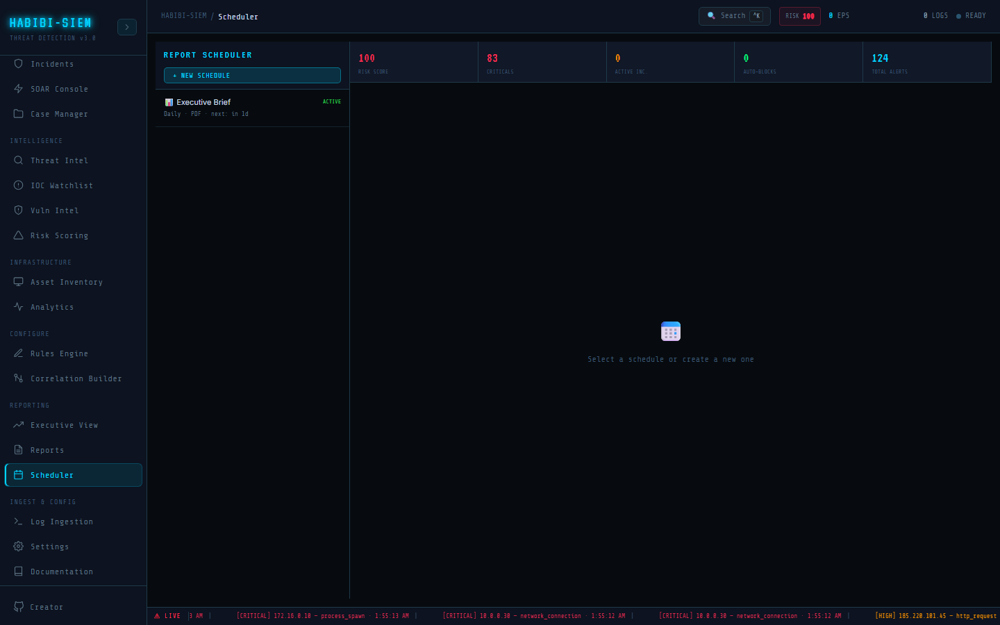

# Operational case for scheduled reports

**Part of:** Reporting → Scheduler
**One-sentence focus:** Why recurring report jobs matter operationally even when this demo simulates delivery.

### What you are looking at

Reporting → Scheduler uses a fixed left rail and a flexible main panel. The left column header reads **REPORT SCHEDULER** in cyan display type, with a full-width primary button labelled **+ NEW SCHEDULE** beneath it. Below that button sits a scrollable list of schedule cards, each card shows a report icon and human-readable type name (for example Executive Brief), a status badge in monospace font reading either **ACTIVE** (green) or **PAUSED** (grey), a secondary line with `{frequency} · {format} · next: {relative time}`, and optionally a tertiary line `last: {relative time}` when a run has occurred. Selecting a card highlights it with a faint cyan wash; paused schedules render at fifty percent opacity. The main panel opens with a five-tile summary bar. **risk score**, **CRITICALS**, ACTIVE INC., **AUTO-BLOCKS**, **TOTAL ALERTS**, each pulling live counts from the current SIEM session. If no schedule is selected, the centre shows a calendar emoji and the prompt "Select a schedule or create a new one." When a schedule is selected, the detail header repeats the report type with action buttons **PAUSE** or **RESUME**, **RUN NOW** (or GENERATING... while busy), and **DELETE**. A two-by-two metadata grid displays Frequency, Format, Next Run, and Last Run. Below that, a REPORT PREVIEW (CURRENT DATA) block renders a monospace snapshot of what the next generated file would contain. At the bottom of the scroll area, completed manual runs append rows under **GENERATION LOG**, showing report type, format, simulated file size, and time. Think of this module as the SOC's publishing desk: it does not replace ad-hoc investigation in Respond → Incidents or the static exports in Reporting → Reports, but it answers the recurring question leadership asks every Monday morning; "What changed in our risk posture since last week?": without an analyst manually screenshotting five dashboards.

### What is happening underneath

Scheduler screen mounts as a React functional component consuming `alerts`, `incidents`, `riskScore`, and `soarLog` from the SIEM context pipeline. Schedule definitions live entirely in local local screen state. initialised with one `defaultSchedule()` object. Each schedule is a plain JavaScript object; there is no REST call to a job queue, no cron daemon, and no SMTP relay. The preview block is a `useMemo` that recomputes whenever upstream SIEM data changes: it counts critical alerts, active incidents (`status === 'active'`), SOAR entries with action `IP_BLOCKED`, and total alert volume. Report types come from the static `REPORT_TYPES` array mapping internal IDs (`executive`, `threat`, `compliance`, `incident`, `UEBA`) to labels, descriptions, and icons. Frequency and format are constrained enumerations, `FREQUENCIES = ['On Demand','Hourly','Daily','Weekly','Monthly']` and `FORMATS = ['PDF','JSON','CSV','HTML']`. The component never evaluates cron expressions; `nextRun` is set once at creation (`Date.now() + 86400000`) and displayed but not advanced by a background timer. Automatic firing on schedule is therefore not implemented in the demo; the operational value today is configuration, preview, and manual **RUN NOW** simulation.

### Why this matters

Security operations produce continuous telemetry; executives and compliance officers consume periodic summaries. Without scheduled reporting, teams either neglect stakeholder communication until an audit scramble or burn analyst hours rebuilding the same PDF before every board meeting. A scheduler encodes institutional rhythm: daily threat intel for the tier-one desk, weekly executive briefs for the CISO, monthly compliance attestations for GRC. Even in this demo build: where email delivery and true cron execution are simulated. The UI teaches the *contract* each schedule record must satisfy: which template, how often, in what format, to whom, and whether it is active. That mental model transfers directly to production integrations (ReportLab, wkhtmltopdf, SendGrid, Windows Task Scheduler, Kubernetes CronJob, or enterprise GRC platforms). Understanding that **ACTIVE** versus **PAUSED** is the kill switch for noisy reports prevents accidental alert fatigue in real deployments. The live preview tying report content to current `riskScore` and incident counts demonstrates that scheduled reports should reflect point-in-time SIEM state, not stale cached snapshots, a design requirement often missed when reports are generated offline from yesterday's database replica.

### Step-by-step walkthrough

1. Sign in to the dashboard and ensure live data exists; run Simulate Campaign from Monitor → Overview or ingest logs under Log Ingestion if counters read zero.
2. Open Reporting → Scheduler from the sidebar.
3. Observe the default Executive Brief schedule in the left list; note **ACTIVE**, Daily · PDF · next: … metadata.
4. Click the card; review the summary bar and REPORT PREVIEW (CURRENT DATA) to confirm numbers match Monitor → Overview KPIs.
5. Click **+ NEW SCHEDULE** to open the **NEW REPORT SCHEDULE** modal.
6. Choose Report Type, Frequency, Format, and enter comma-separated Recipients (e.g., `soc@company.com, ciso@company.com`).
7. Click **CREATE**; the new card appears in the list: select it and verify detail fields.
8. Click **RUN NOW**; watch the button change to GENERATING... for approximately 1.5 seconds.
9. Confirm Last Run updates and a row appears in **GENERATION LOG** with green size text.
10. Click **PAUSE** to disable the schedule; note list opacity and **PAUSED** badge, then **RESUME** to re-enable.

### Common questions

#### Why does my schedule not run automatically at the next time shown?

The demo stores `nextRun` for display only. No background worker polls schedules. Only **RUN NOW** triggers generation. Production would attach a cron executor or cloud scheduler to honour Daily, Weekly, etc.

#### Which report type should I pick for leadership?

Executive Brief summarises risk posture, KPIs, and top incidents. Best for C-suite cadence; Threat Intelligence suits SOC managers tracking IOC hits and attacker trends. Compliance Summary aligns with audit committees. Match the template to the readership described in each option's subtitle in the modal dropdown.

#### Do scheduled reports replace **Reporting → reports**?

No. Reports focuses on immediate export of the current view. Scheduler models recurring jobs and shows a template preview. In production, both might share the same PDF engine but serve different workflows, ad-hoc versus standing orders.

#### Can I schedule reports without recipients?

The UI allows an empty Recipients field; the schedule saves, but nothing would be emailed even if delivery were implemented. Operational policy should require at least one distribution address before enabling **ACTIVE**.

### Operational use during containment

During a major **ACTIVE** incident surge, the SOC lead pauses non-necessary Weekly executive schedules to avoid misleading risk-score snapshots mid-containment, while keeping an On Demand Incident Report schedule **ACTIVE** for instant **RUN NOW** before the 09:00 executive stand-up. They select the Incident Report card, confirm ACTIVE INC.In the preview matches Respond → Incidents, and trigger **RUN NOW** to produce a log entry leadership can reference: even though email is simulated, the **GENERATION LOG** timestamp documents when the analyst pulled the brief. After **RESOLVED**, they **RESUME** paused schedules so Monday's automated cadence resumes without manual rebuild.

### Edge cases and gotchas

Creating many schedules without deleting old ones clutters the 280-pixel left rail. There is no search or sort. Recipients captured at creation are not editable in the detail pane; you must delete and recreate to change distribution lists. Pausing a schedule does not cancel an in-flight GENERATING... run. Summary bar counts are global session metrics, not filtered per report type, an UEBA Report preview still shows organisation-wide **CRITICALS**, which may confuse readers expecting user-behavior-only figures. Demo nextRun never advances after manual runs, so "next: in 1d" can become stale relative to real clocks.

> **Technical note:** `defaultSchedule()` assigns `id: crypto.randomUUID()`, `reportType: 'executive'`, `frequency: 'Daily'`, `format: 'PDF'`, `recipients: ''`, `enabled: true`, `lastRun: null`, and `nextRun` as ISO string twenty-four hours ahead. Initial state: `useState([defaultSchedule()])`.
