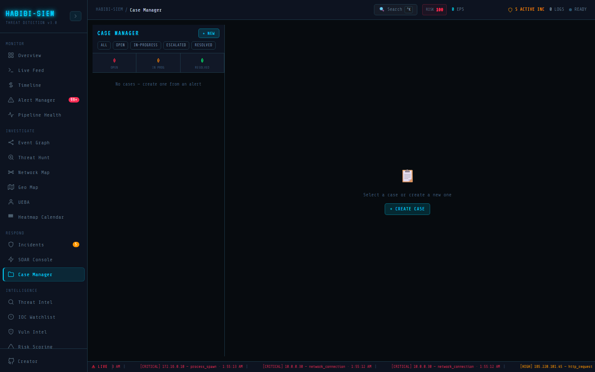

# Reporting from cases

**Part of:** Respond → Cases
**One-sentence focus:** Long-running investigation containers with persistent notes, ownership, and lifecycle status.

### What you are looking at

No "generate report from case" button. Closed cases appear in list when filter **RESOLVED** or status closed. Data feeds executive narrative indirectly via analyst copy into Reporting → Reports or manual board slides.

### What is happening underneath

Persisted cases available to future API consumers. `exportReport` in the SIEM context pipeline generates global security report string; not case-specific. Compliance mapping (ISO, SOC 2) requires human to map case notes to controls. Respond → Case Manager (Case Manager screen) exists because alerts are volatile, incidents are correlated views with ephemeral scratchpad notes, and investigations that survive legal review need durable records. Cases persist through `api.saveCase` with fields `id`, `alertId`, `title`, `status`, `priority`, `assignee`, `notes[]`, `createdAt`, `updatedAt`, and `tags[]`. The UI exposes title, status, priority, assignee, and append-only notes; tags and related alert linking are partially implemented in data but not fully rendered. Treat the 320px list column as your investigation inbox: border colour encodes priority; status chips filter **OPEN**, **IN-PROGRESS**, **ESCALATED**, **RESOLVED** while **CLOSED** exists in the model but lacks a filter chip, auditors searching closed work must select **RESOLVED** or browse unfiltered.

### Why this matters

Cases are evidentiary units for "we handled 47 material investigations this quarter." Without export, value is trapped unless integrated.

### Step-by-step walkthrough

1. Close case with resolution note summarising impact, root cause, lessons.
2. Copy note text into monthly SOC metrics spreadsheet.
3. Use Reporting → Executive View for aggregate KPIs.
4. Store case UUID in GRC tool evidence locker.
5. Retention per policy; backend backup.

### Common questions

#### PDF export per case?

Not shipped: copy/paste or extend API.

#### Do closed cases feed threat intel?

Manual. Analyst adds IOCs to watchlist from findings.

#### Compliance report automation?

#### Analyst performance metrics?

Count cases resolved per assignee manually from list.

### Operational use during containment

Less live, but within 48h post-incident, case closure note becomes management email draft. Creation flows through **+ NEW** modal calling `createCase(null, title)`; there is no alert picker despite `createCase(alertId, title)` supporting linkage. Default priority is high; assignees draw from a static roster (alice.chen, bob.martin, carol.white, dave.singh, unassigned). Notes append with `{ text, ts: Date.now(), author: 'analyst' }`; author is a literal string, not session username: production hardening should map authenticated identity. Each `updateCase` patch refreshes `updatedAt`, giving a coarse timeline for compliance even without a dedicated history tab. Single assignee dropdown forces teams to denote secondary contributors in note prefixes. Server saves occur on each update without websockets. Another analyst's notes appear after refresh, not live. Concurrent note appends spread `selectedCase.notes` then append, race conditions possible if two tabs add simultaneously; operational workaround is verbal coordination on bridge. For evidence chain, never edit prior notes (UI prevents edits anyway); append corrections. Reference SOAR log timestamps, Alert Manager exports, and Live Feed pulls explicitly in note text until attachment support exists. Cases are the investigation binder that survives browser restarts because `api.saveCase` persists JSON server-side. Until the UI renders `relatedAlerts` or accepts `alertId` in the create modal, paste alert identifiers and IPs into the first note deliberately. Status vocabulary should match your ITSM tool definitions in runbooks even though the software allows arbitrary transitions like open directly to closed.

### Edge cases and gotchas

Without closed filter, old cases hard to find in long lists. Simulate cases should be labelled in title to avoid polluting executive metrics. Open a case within thirty minutes of any P1 bridge call. Use Incidents for tactical playbook execution; use Case Manager for chronology, evidence references, executive summaries, and closure language. The `relatedAlerts` memo matches `alertId` or shared `sourceIp`, but modal create does not set `sourceIp` on the case object; paste IP and alert IDs into notes until UI linking ships. For false positives, still consider a short case or structured note: "FP: tuned rule XYZ" creates audit trail that Incidents **DISMISSED** override does not persist.
