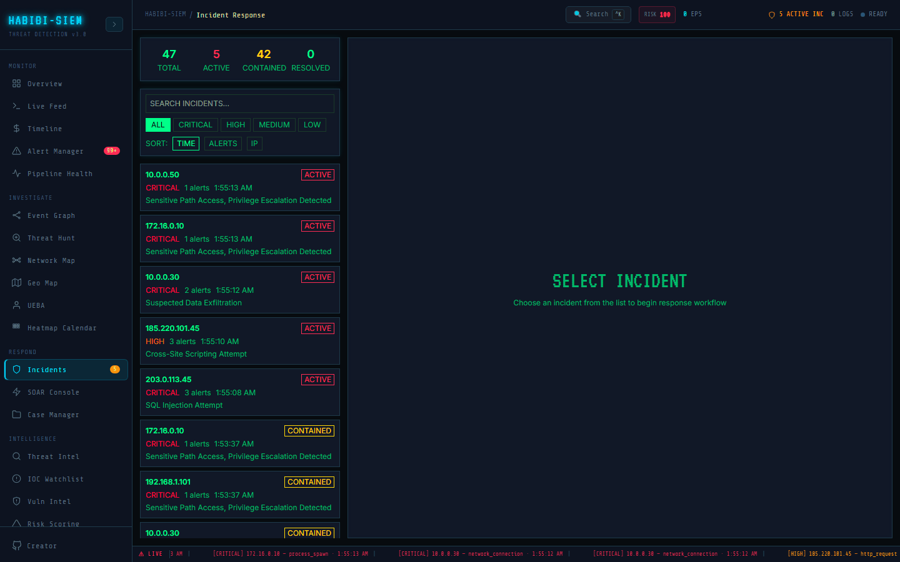

# Incident Response

**Sidebar:** Respond → Incidents

## Steps

1. Open the published dashboard and sign in.
2. Open Respond → Incidents from the sidebar.
3. If the view is empty, run Simulate Campaign on Overview or add logs under Log Ingestion.

## Screenshots

## When the view looks empty

Most modules depend on alerts existing in the current session. From Overview, run **Simulate Campaign**, or paste a sample under Ingest → Log Ingestion, then return here. Refresh once if tiles stay at zero.

## Roles

Read-only analysts can explore visuals but may see 403 on SOAR or watchlist actions. Use analyst2 or manager accounts when the lab requires writes.

## Where to read more

Open the module INDEX in this folder for long-form pages on each button and metric. Security-wide behavior (CSRF, sessions) is described under docs/08-security.

## Reporting tip

Capture the sidebar path, role used, and one screenshot after data is visible. If the view was empty at first, note whether Simulate Campaign or Log Ingestion fixed it. Link to the module INDEX for grader context.
## Metrics and filters

Before concluding the module is broken, clear time and severity filters, confirm deduplication in Settings, and note which user tier you used. Tables and KPI tiles read from the same alert pool; a filter on one screen may not change Overview summary numbers.

## Reporting tip

Capture sidebar path, role, and one screenshot after data is visible. If the view started empty, record whether Simulate Campaign or Log Ingestion fixed it. Link the module INDEX in your lab appendix.
