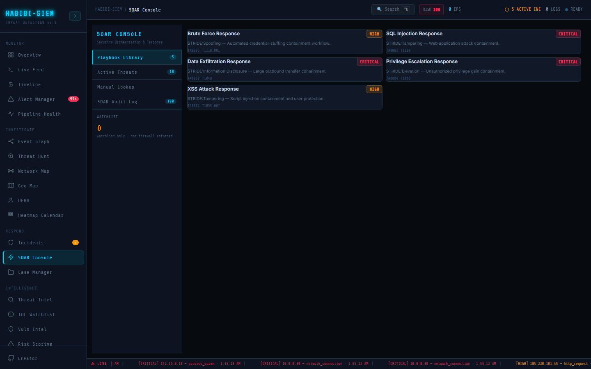

# Building new playbooks

**Part of:** Respond → SOAR
**One-sentence focus:** Review automated orchestration, enrichment lookups, playbooks, and the SOAR audit log.

### What you are looking at

There is no visual playbook builder. Developers extend the `PLAYBOOKS` array: each entry needs human-readable name, description, **`sopSteps` strings**, MITRE mitreTactic / technique, severity badge, triggerRule key, and automatedCountermeasure label (today always `blockIp`). The UI immediately reflects new array entries in Playbook Library count badge.

### What is happening underneath

Playbooks are documentation-only unless paired with detection rule changes and optional future workflow engine. Chaining would require executing `sopSteps` programmatically; out of scope. Conditions like "score > 75" duplicate `SOAR_BLOCK_THRESHOLD` constant; keep in sync manually. Respond → SOAR Console (SOAR Console screen) implements the shape of enterprise SOAR, playbooks, enrichment, containment, audit; without claiming hundreds of vendor integrations. The 220px left rail is fixed width so playbook counts, active threat counts, and watchlist totals remain visible while analysts scroll long audit tables. Every containment action funnels through the block-IP action in the SIEM context pipeline, which calls watchlist API, updates the `blockedIps` Set, and writes a SOAR log row with `enforcement: 'watchlist_only'`. That string is not cosmetic; it is the honest contract that demo blocking is correlation and visibility, not automatic firewall drop. Brief executives using airport security analogies: lookup is passport check; watchlist is the no-fly list; true network block requires a separate enforcement plane you integrate in production. The five shipped playbooks (brute force, SQL injection, data exfiltration, privilege escalation, XSS) are static `PLAYBOOKS` array entries, reference documents, not executable workflows. Each includes MITRE tactic/technique codes, STRIDE-flavoured descriptions, six SOP steps, and a displayed `automatedCountermeasure: 'blockIp'`. During bridge calls, read SOP steps aloud while a scribe tracks completion in Case Manager; do not assume clicking the playbook executes step 3 on a firewall. When adding a sixth playbook in code, mirror checklist steps in Incidents screen's `PLAYBOOK` constant to avoid trainee confusion between modules.

### Why this matters

Teams outgrow five templates. Documenting how to add a sixth (e.g., ransomware) guides maintainers without pretending a GUI exists.

### Step-by-step walkthrough

1. Identify gap (no Ransomware Response card).
2. Edit SOAR Console screen `PLAYBOOKS` push new object with unique `id`.
3. Align `triggerRule` with rules engine category string.
4. Reload app; verify card appears with correct badge.
5. Pair with Incident Response `PLAYBOOK` constant for checklist parity.
6. Update documentation screenshots if needed.

### Common questions

#### Can analysts build playbooks without code?

Not in HABIBI-SIEM demo. Use Case Manager checklists externally.

#### How are conditions evaluated?

Only IP score threshold is live code; SOP "if" lines are human instructions.

#### Can one playbook chain to another?

#### How to add non-block actions?

Extend `automatedCountermeasure` string and implement handler in context, currently display-only.

### Using this view during live response

Analyst requests new playbook from engineering after novel attack; interim uses **DEFAULT** incident playbook. Automatic enrichment on ingest executes inside log processing when severity is critical or high, the IP is public (non-RFC1918), and `canWrite` is true. The path calls `soarCheckIp` → GET `/api/threat/ip/:ip` → AbuseIPDB proxy, logging IP_LOOKUP, IP_SCORED, or IP_LOOKUP_ERROR. When `abuseConfidenceScore` exceeds `SOAR_BLOCK_THRESHOLD` (75) or CISA-known-bad flags apply server-side, `blockIp` may run with operator **SYSTEM**. Manual paths on Active Threats and Manual Lookup attribute `usernameRef.current` as operator. Train analysts to read the audit log after every campaign: automation silently failing (API key missing, rate limit) looks like "nothing happened" unless IP_LOOKUP_ERROR rows are monitored.

### Edge cases and gotchas

Drift between SOAR SOP text and Incident Response steps confuses trainees. MITRE IDs must be valid or reports look amateurish. SOAR Console does not ship MTTR widgets, yet MTTR is derivable: timestamp first critical alert (`firstSeen` in Incidents), timestamp first WATCHLIST_ADD in audit log, timestamp alert resolution in Alert Manager. Track false positives by auditing manual unblocks (`unblockIp`) within twenty-four hours of auto blocks, not instrumented today, but necessary before raising `SOAR_BLOCK_THRESHOLD`. Read-only sessions disable automation during ingest: verify role assignments before blaming "SOAR broken" during demos. Treat the footer disclaimer (watchlist only, not firewall enforced) as mandatory language in every executive deck involving SOAR metrics. The audit log is your strongest compliance artefact in this module: pair **TIME** with Incidents **FIRST SEEN** and Case Manager note timestamps when reconstructing timelines. If IP_LOOKUP_ERROR spikes during an exercise, check API key configuration before assuming attacks stopped.
